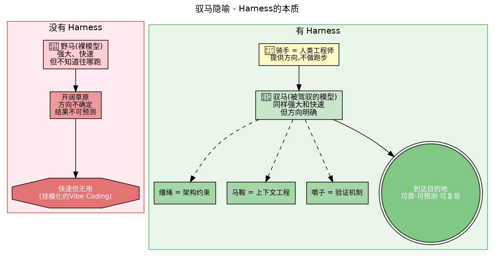
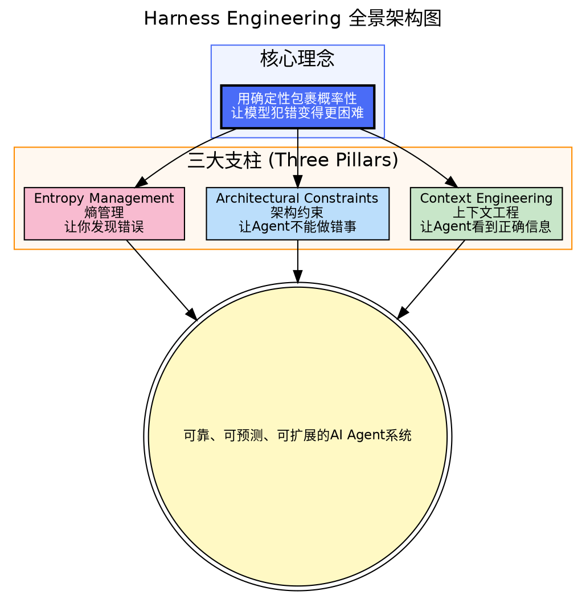
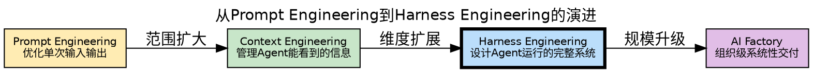

# Module 0: 什么是Harness Engineering

## 0.1 一句话定义

> **Harness Engineering = 设计AI Agent运行的完整系统，使输出质量依赖于结构而非模型智力。**

"Harness"源自马具——缰绳、马鞍、嚼子——一整套驾驭强大但不可预测的动物的装备。

📐 查看Graphviz源码 (08-horse-metaphor.dot)

## 0.1b 另一个隐喻：法律系统（来自Salesforce）

> AI模型是**律师**——拥有知识和推理能力。但律师单独无法实现法治。你需要**法庭和法官**（系统结构）、**法律条文**（约束规则）、**陪审团**（人类判断）。Agent Harness就是那套监督和控制系统。

**Framework vs. Harness 的区别：**

| | Agent Framework | Agent Harness |
|---|---|---|
| **定义** | 构建Agent逻辑的**库和积木** | 管理Agent运行的**运行时基础设施** |
| **类比** | 蓝图 | 工厂车间 |
| **负责** | "做什么"（what）和"为什么"（why） | "怎么做"（how）和"在哪做"（where） |
| **例子** | LangChain, CrewAI, AutoGen | AGENTS.md + CI/CD + 验证循环 + 状态管理 |

> **2025年大家追逐更强的Frontier模型，2026年行业意识到：即使最先进的模型也无法弥补Agent基础设施的缺失。焦点从模型中心设计转向基础设施中心设计。** ——Salesforce

## 0.1c 长期运行Agent的四种失败模式

没有Harness的长期Agent会怎样崩溃？（来自Salesforce实践总结）

| 失败模式 | 描述 | Harness如何解决 |
|----------|------|----------------|
| **上下文腐烂（Context Rot）** | Context Window被日志塞满，Agent忘记原始目标 | Harness管理窗口内容：压缩历史+按需注入 |
| **AI失忆（AI Amnesia）** | 模型无状态，系统重启则进度全丢 | Harness持久化Agent状态，支持断点续跑 |
| **幻觉工具调用** | Agent用错参数或发明不存在的工具 | Harness在每次工具调用前拦截+校验 |
| **资源失控** | Agent反复调用昂贵API，成本飙升 | Harness缓存+限流+成本监控 |

## 0.1d Harness的五层解剖（来自LangChain）

LangChain产品负责人Vivek Trivedy给出最干脆的定义：**Agent = Model + Harness**。更狠的一句：

> **"If you're not the model, you're the harness."**

这把所有以前被视为"外围实现细节"的东西——工具描述、MCP、hooks、中间件、沙箱、浏览器、filesystem、subagent路由——全部纳入了Harness的边界。

综合LangChain系列文章与两篇2026年论文（Meta-Harness、AutoHarness），Harness至少分为5层：

| 层级 | 名称 | 职责 | 关键问题 |
|------|------|------|----------|
| **L1** | Context Layer 上下文编排层 | system prompt、tools/skills描述、hook注入、检索记忆、tool结果拼接 | 模型当前能看到什么？ |
| **L2** | Runtime Layer 执行环境层 | filesystem、bash/代码执行、浏览器、沙箱、网络权限、验证工具 | 模型能在哪里干活？ |
| **L3** | Control Layer 循环控制层 | ReAct循环、compaction、continuation、pre-completion检查、subagent交接、模型路由 | 模型能不能长时间稳定工作？ |
| **L4** | Memory Layer 状态经验层 | 对话历史、tool输出压缩、跨会话记忆、租户/用户/组织级记忆、离线整合、检索排序 | 系统越跑越像有经验吗？ |
| **L5** | Improvement Layer 可进化层 | traces收集、eval构建、optimization/holdout拆分、harness hill-climbing、人工review | 系统能持续自我变好吗？ |

> **关键转向：Agent的改进对象，不再只是模型，而是Harness这层系统设计本身。** LangChain只改Harness、模型不变，就把Terminal Bench 2.0从52.8%拉到66.5%。两篇论文（Meta-Harness、AutoHarness）共同说明：**Harness已经不是"工程实现细节"，而是Agent Intelligence的一等公民。**

## 0.1e Agent落地的五个卡点

当你把Agent从Demo推向生产，会遇到5类系统性问题：

| 卡点 | 描述 | Harness解法 |
|------|------|-------------|
| **无限循环** | Agent在工具调用和任务分解里打转 | Control Layer的循环检测 + 超时终止 |
| **上下文爆炸** | 任务变长后信息越来越多，质量越来越差 | Context Layer的压缩 + 渐进式披露 |
| **权限失控** | Agent可以删文件、调API、执行危险操作 | Runtime Layer的沙箱 + Allow/Deny/Ask |
| **质量不可控** | 模型不会稳定自我验收，自信地交付错误结果 | Improvement Layer的Eval驱动 + 人工审查 |
| **成本不透明** | 任务跑完了，才发现token/时间/外部资源成本过高 | Control Layer的预算监控 + 缓存 |

这套五分法的好处：它把"Agent怎么总出幺蛾子"的抱怨，转成了可以工程化处理的系统问题，每一个都有对应的Harness层级来解决。

## 0.2 为什么需要Harness

AI模型有三个致命常量：

| 常量 | 含义 | 后果 |
|------|------|------|
| **概率输出** | AI靠概率生成，不同运行结果不同 | 不可预测 |
| **有限上下文** | Context Window有上限 | 注意力衰减 |
| **模式复制** | Agent习得一切可见模式 | 坏习惯传染 |

**结果：不可预测 + 注意力衰减 + 坏习惯 = Agent不可靠**

**解决方案：用确定性包裹概率性 → Harness**

## 0.3 核心数据支撑

- **LangChain**: 同一模型，换Harness → Terminal Bench 2.0 从52.8%提升到66.5%（Top30→Top5）
- **OpenAI**: 5个月，100万+行代码，零人工编写行，全部由Codex Agent在Harness内完成
- **Stripe**: 内部Agent "Minions" 每周合并1000+ PR，开发者只看步骤1(下任务)和步骤5(审核)
- **Vercel**: 超过80%代码由Agent在约束下生成

## 0.4 Harness Engineering 全景架构

📐 查看Graphviz源码 (00-harness-overview.dot)

## 0.5 从Prompt Engineering到Harness Engineering的演进

📐 查看Graphviz源码 (00-harness-vs-others.dot)

**关键关系**：`AI Factory ⊃ Harness Engineering ⊃ Context Engineering ⊃ Prompt Engineering`

## 0.6 关键术语表

| 术语 | 窄义定义 |
|------|----------|
| **Model/LLM** | 基础智力层：token进，token出。独立时不记忆、不读仓库、不运行命令 |
| **Harness** | 模型周围的一切：指令、上下文、工具、运行时、权限、审查循环、验证 |
| **Agent** | 一个被驾驭的循环：能决策、行动、观察、继续，直到完成或阻塞 |
| **Vibe Coding** | 低结构化的接受-迭代工作流。适合探索和原型，弱于正确性和可重复交付 |
| **AI Factory** | 组织级系统：反复将意图转化为已交付的工作。部分是工程，部分是产品运营 |
