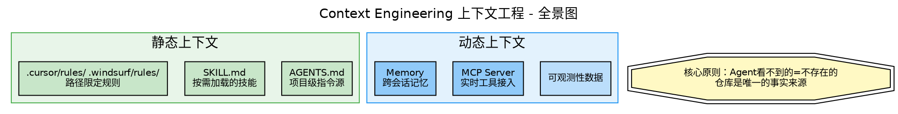

# Module 1: Context Engineering 上下文工程

> **核心原则：Agent看不到的 = 不存在的。仓库是唯一的事实来源。**

## 1.1 全景图


<details>
<summary>📐 查看Graphviz源码 (01-context-engineering.dot)</summary>


</details>

## 1.2 AGENTS.md：Agent的README

**AGENTS.md** 是一个简单的、开放的Markdown格式，专门用于指导AI编程Agent。

### 为什么不直接用README.md？

- `README.md` 是给人看的：快速开始、项目描述、贡献指南
- `AGENTS.md` 是给Agent看的：构建步骤、测试命令、编码约定等Agent需要的额外详细上下文

### 一个优秀AGENTS.md的结构

```markdown
# AGENTS Guidelines

## 项目概述
简要描述项目架构和核心技术栈

## 开发环境
- 使用 `pnpm dev` 启动开发服务器
- 不要在Agent会话中运行 `npm run build`

## 编码约定
- 使用TypeScript (.tsx/.ts)
- 组件样式与组件同目录

## 测试指令
- 运行 `pnpm test` 执行测试套件
- 提交前必须通过所有测试

## 安全考虑
- 所有端点需要身份验证
- 不使用 eval() 或 exec()

## PR规范
- 标题格式: [scope] description
- 必须运行 lint 和 test
```

### 分层AGENTS.md（大型项目）


<details>
<summary>📐 查看Graphviz源码 (01-agents-md-hierarchy.dot)</summary>

```dot
// 见 dots/01-agents-md-hierarchy.dot
```
</details>

**关键规则：**
- 最近的AGENTS.md优先（目录树就近原则）
- 用户聊天中的显式指令覆盖一切
- OpenAI主仓库有88个AGENTS.md文件

### 真实案例：LangChain的AGENTS.md

LangChain的AGENTS.md（268行）是一个教科书级别的示例，包含：

1. **Monorepo结构图** — 让Agent理解项目架构
2. **开发工具和命令** — uv, make, ruff, mypy, pytest
3. **核心开发原则** — 保持公共接口稳定（CRITICAL标记）
4. **代码质量标准** — 所有Python代码必须有类型注解
5. **测试要求** — 每个新功能/bugfix必须有单元测试
6. **安全和风险评估** — 禁止eval/exec/pickle
7. **文档标准** — Google风格docstring
8. **CI/CD基础设施** — Release流程、PR标签、Lint

> 📂 **参考**: `refs/codes/langchain-master/AGENTS.md`

## 1.3 Progressive Disclosure（渐进式披露）

**来自ETH Zurich的研究发现**：详细的仓库上下文通常增加成本，而且当添加不必要的需求时反而会降低任务成功率。

**最佳实践：**
- 根级上下文保持精简
- 工具专属行为只放在对应位置
- 局部/路径特定约束放在更窄的范围
- 偶尔需要的工作流用按需Skills

### Plugin vs. Skill

| | Skill | Plugin |
|---|---|---|
| **形式** | 单个SKILL.md文件 | 目录 + plugin.json |
| **调用** | /deploy | /plugin-name:command |
| **内容** | 一个工作流 | 多个Skills + Hooks + MCP |
| **适用** | 个人工作流 | 团队分发 |

## 1.4 Harness的四大核心组件（来自Salesforce）

一个生产级的Harness不是单一代码，而是一个**模块化子系统**：

| 组件 | 职责 | 关键技术 |
|------|------|----------|
| **上下文工程与管理** | 管理Agent能"记住"什么 | 压缩（将50页日志浓缩为要点）+ RAG按需注入 |
| **工具编排与护栏** | 控制Agent与外部系统的交互 | 拦截请求→校验权限→隔离执行→清洗输出→回传模型 |
| **Human-in-the-Loop** | 敏感操作暂停等待人类审批 | 中断机制：Agent草拟→Harness暂停→人类审批→继续 |
| **生命周期与状态管理** | Agent的"出生"和"续命" | 初始化提示词+权限→持续快照状态→崩溃后断点恢复 |

## 1.5 多工具共存策略

如果你同时使用Claude Code和Codex/Cursor/Windsurf：

```bash
# 方案1（最简单）：符号链接
ln -sf AGENTS.md CLAUDE.md

# 方案2：引用
# 在CLAUDE.md中写: @AGENTS.md

# 方案3：指针
# CLAUDE.md只写一行: READ AGENTS.md FIRST
```

**各工具启动时的加载行为对比**（来自escape.tech实地调查）：

| 工具 | 加载的文件 | 忽略的文件 |
|------|-----------|-----------|
| **Claude Code** | `CLAUDE.md`(→AGENTS.md) + `.claude/CLAUDE.md` + `.claude/rules/*.md` + `.claude/skills/` | — |
| **Codex** | 根目录`AGENTS.md` + 子目录`AGENTS.md`（如`src/api/AGENTS.md`） | `.claude/` 目录 |
| **Cursor** | `.cursor/rules/*.md` + 根目录`AGENTS.md` | `.claude/` 目录 |
| **Windsurf** | `AGENTS.md`（通过openskills同步） + `.windsurf/rules/` | `.claude/` 目录 |
| **Kilo Code** | `AGENTS.md` + `~/.kilo/skills/` + `.claude/skills/`(兼容) | — |

## 1.6 记忆所有权：你不拥有Harness，就不拥有记忆

> **"If you don't own your harness, you don't own your memory."** ——LangChain

大多数人把记忆当作"会话历史插件"。但在Harness五层模型中，Memory Layer（L4）是一个**系统层**：

- **短期记忆** = 当前会话的对话历史 + tool输出压缩
- **中期记忆** = 跨会话的Windsurf Memory / CLAUDE.md / 项目状态文件
- **长期记忆** = 组织级知识库、Eval结果、反馈规则沉淀

**平台锁定风险：** 如果你的记忆全存在Windsurf Memory或Cursor内部数据库里，换工具时记忆就丢了。

**解法：** 将所有重要规则和积累写入 `AGENTS.md` / `CLAUDE.md` —— 这是纯文本、可版本控制、跨工具共享的记忆载体。

### 跨工具Skills共享架构（实战参考）

当你同时使用5个AI工具时，Skills和规则各存一份会导致不同步。实践中验证有效的方案：

```
唯一源目录（Single Source of Truth）
~/.claude/skills/           ← 所有Skills的真正存放处

各工具通过不同机制发现同一份内容：
├── Claude Code  → 原生扫描 ~/.claude/skills/
├── Windsurf     → symlink ~/.windsurf/skills/ → ~/.claude/skills/*
├── Cursor       → symlink ~/.cursor/skills-cursor/ → 反向引用
├── Codex        → symlink 纳入SSOT
└── Hermes       → config.yaml external_dirs 指向 ~/.claude/skills/
```

**核心原则：改一处 → 多处同时生效。** 任何重要的、需要跨工具生效的规则，必须写入版本控制的纯文本文件，而不是依赖某个工具的内部记忆。

## 1.7 🔬 Lab 1: 创建你的第一个AGENTS.md

> **动手时间！** 在 `tutorial/labs/` 下创建一个模拟项目

```bash
mkdir -p tutorial/labs/lab01-my-first-harness
cd tutorial/labs/lab01-my-first-harness
```

**任务：**
1. 创建一个`AGENTS.md`，包含：项目概述、开发命令、编码约定、测试指令
2. 创建一个`.windsurf/rules/coding.md`，添加路径限定规则
3. 让Cascade读取你的AGENTS.md，观察它的行为变化
