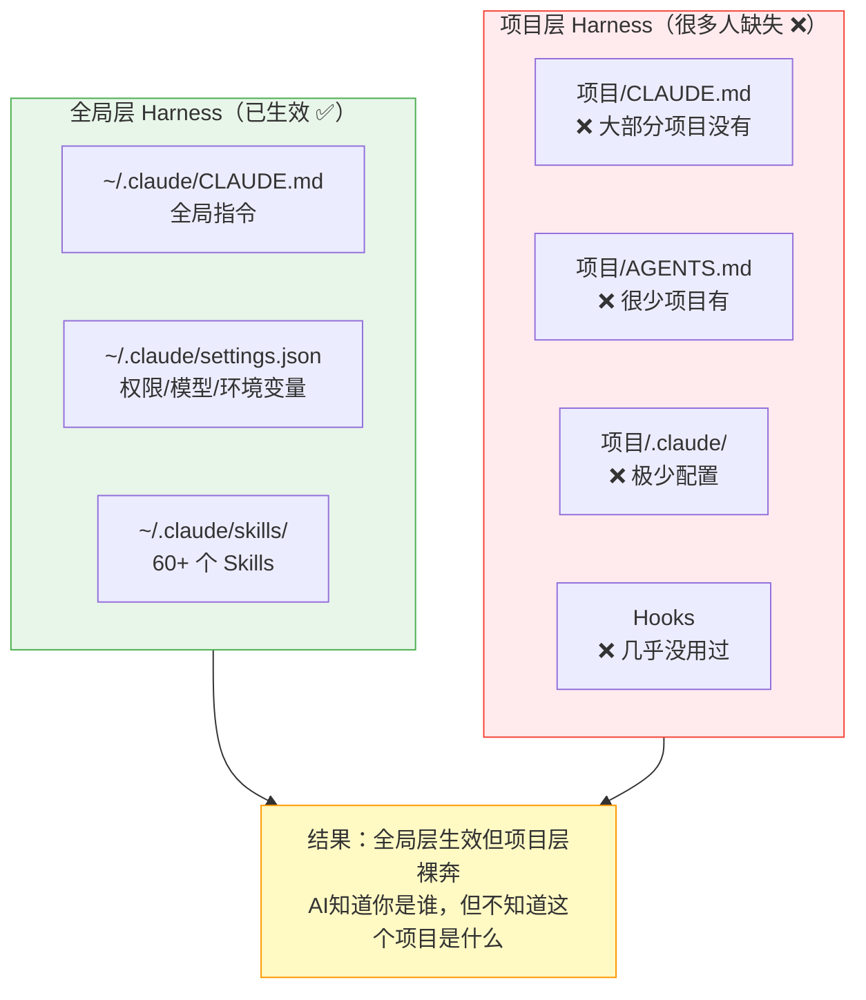

# Module 8: 给已有项目布Harness实操指南

> **核心问题：我已经有项目了，但之前没布Harness，现在该怎么补？以及，怎么让CC帮我布？**

## 8.1 你可能已经"半布"了Harness

大多数人的状态是这样的：



### 自检清单

问自己这些问题：

| # | 问题 | 有 = 布了 | 没有 = 没布 |
|---|------|-----------|-------------|
| 1 | 我的项目根目录有 `CLAUDE.md` 吗？ | AI 进来就知道项目是什么 | AI 每次都在猜 |
| 2 | 有 `AGENTS.md` 吗？ | AI 知道构建命令、测试命令 | AI 每次都要问你 |
| 3 | 有 `.claude/settings.json` 吗？ | 权限预设好，不反复弹窗 | 每次都 yes/no |
| 4 | 有 `.claude/commands/` 吗？ | 常见操作一个命令搞定 | 每次都重新描述 |
| 5 | AI 犯过的错，有没有写进约束里？ | 错误不会重复 | 同样的坑反复踩 |

**如果 5 条里只有 0-1 条是"有"，说明你的项目基本在裸奔。**

## 8.2 Harness 的三级成熟度（对照你自己）

| 级别 | 名称 | 配置内容 | 效果 | 花费时间 |
|------|------|----------|------|----------|
| **L0** | 裸奔 | 什么都没有 | 每次聊天都从零开始 | 0 |
| **L1** | 基础可用 | CLAUDE.md + 基本权限 | AI 不瞎猜，但你还得盯着 | 15分钟 |
| **L2** | 自主运行 | L1 + Skills + Hooks + 验证 | AI 能独立干活且很少犯错 | 1-2小时 |
| **L3** | 持续进化 | L2 + Memory + Eval + 复盘循环 | AI 越用越好，经验会积累 | 持续 |

**绝大多数个人项目做到 L1 就够用了。** L1 的 ROI 最高——花 15 分钟，之后每次交互都省时间。

## 8.3 最小可行 Harness（15分钟 L1）

### 你只需要创建 1 个文件：`CLAUDE.md`

这是投入产出比最高的一步。一个好的 CLAUDE.md 只需要回答 4 个问题：

```markdown
# 项目名

## 这是什么项目
一句话描述项目目标和当前状态。

## 技术栈
- 语言：xxx
- 框架：xxx
- 包管理：xxx
- 数据库：xxx（如果有）

## 常用命令
- 启动开发：`xxx`
- 运行测试：`xxx`
- 构建：`xxx`
- 部署：`xxx`

## 不要做的事
- 不要 xxx（列出 AI 之前犯过的错）
- 不要修改 xxx 文件
- 不要安装 xxx 依赖
```

**就这么简单。** 这 4 段话的价值，比你之后补再多 skills 都大。

### 实际例子：给一个 Next.js 项目布 L1

```markdown
# Internal Dashboard

## 这是什么项目
公司内部KPI看板，已上线使用中。当前版本 v2.3，主要用户是管理层。

## 技术栈
- Next.js 14 (App Router) + TypeScript
- UI: shadcn/ui + TailwindCSS
- 数据: Prisma + PostgreSQL
- 部署: Vercel

## 常用命令
- `pnpm dev` — 启动开发服务器
- `pnpm test` — 跑 Vitest 测试
- `pnpm db:push` — 同步数据库 Schema
- `pnpm lint` — ESLint 检查

## 不要做的事
- 不要删除或修改 `prisma/migrations/` 下的已有迁移文件
- 不要用 `npm`（本项目统一用 pnpm）
- 不要在组件里直接写 SQL，所有数据库操作走 `src/server/` 层
- 不要升级 Next.js 大版本（14 -> 15），我们还没准备好迁移
```

## 8.4 怎么让 Claude Code 帮你布 Harness

这是最实用的部分。**你不需要自己从零写这些文件，可以让 CC 帮你生成。**

### 方法一：一句话让 CC 生成 CLAUDE.md

进入你的项目目录，然后对 CC 说：

```
帮我看一下这个项目的结构，然后生成一个 CLAUDE.md。
要求：
1. 描述清楚项目是什么
2. 列出技术栈
3. 列出常用命令（你从 package.json / Makefile / README 里推断）
4. 列出你觉得 AI 在这个项目里容易犯的错
```

CC 会：
1. 读取项目文件结构
2. 分析 `package.json`、`README.md`、配置文件
3. 推断技术栈和构建命令
4. 生成一份 CLAUDE.md

你审阅修改后保存即可。

### 方法二：让 CC 帮你从 L1 升级到 L2

当你用了一段时间发现 AI 反复犯同样的错，或者你每次都要重复解释同一件事，对 CC 说：

```
基于我们过去几次的交互，帮我更新 CLAUDE.md：
1. 把你之前犯过的错加到"不要做的事"里
2. 把我经常让你做的操作，考虑写成 .claude/commands/ 下的命令
3. 如果有些权限我每次都批准，帮我加到 .claude/settings.json 的 allowlist 里
```

### 方法三：使用 `/init` Skill（内置）

Claude Code 有一个内置的 `/init` skill，专门做这件事：

```
/init
```

它会自动扫描项目并初始化 harness 配置。

### 方法四：使用 gstack 的 `/spec` 来规范化

如果你的项目还没有明确的 spec 和约束：

```
/spec
```

gstack 的 `/spec` 会引导你把模糊的意图变成精确的规格文档。

### 方法五：使用 OpenSpec 来管理需求规格

```bash
cd your-project
openspec init
/opsx:propose
```

OpenSpec 会帮你建立 spec 驱动的工作流程。

## 8.5 完整 L2 Harness 文件清单

当你准备投入更多时间，这是一个完整 L2 的目标结构：

```
your-project/
├── CLAUDE.md              # [必须] 项目说明 + 约束
├── AGENTS.md              # [推荐] 更详细的 Agent 指南
├── .claude/
│   ├── settings.json      # [推荐] 项目级权限预设
│   └── commands/          # [可选] 项目专属命令
│       ├── deploy.md      # /project:deploy
│       └── test-all.md    # /project:test-all
├── .openspec/             # [可选] 如果用了 OpenSpec
│   ├── specs/
│   └── changes/
└── .understand-anything/  # [可选] 如果用了知识图谱
```

### 每个文件的角色

| 文件 | 核心问题 | 没有它的后果 |
|------|----------|--------------|
| `CLAUDE.md` | "这个项目是什么？" | AI 每次都在猜测技术栈和规范 |
| `AGENTS.md` | "具体怎么干活？" | AI 不知道构建命令、测试方式 |
| `.claude/settings.json` | "允许做什么？" | 每次操作都弹权限确认 |
| `.claude/commands/` | "重复操作怎么触发？" | 每次都要重新描述一遍 |

## 8.6 实战：5分钟给你的任何项目补 Harness

以下是一个你可以直接复制粘贴到 Claude Code 里的 Prompt，适用于任何已有项目：

```
请帮我为当前项目搭建基础 Harness。按以下步骤执行：

1. 先读取项目根目录的文件结构（只看顶层 + 关键配置文件）
2. 推断出：项目类型、技术栈、构建命令、测试命令
3. 生成 CLAUDE.md，包含：
   - 项目概述（一句话）
   - 技术栈清单
   - 常用命令速查
   - "不要做"清单（根据项目类型推断常见 AI 陷阱）
   - 目录结构简述（哪些目录是什么作用）
4. 如果发现了 package.json / Makefile / docker-compose 等，
   把对应的命令提取到 CLAUDE.md 的"常用命令"中
5. 最后告诉我：建议后续补充哪些配置

不要过度工程化。CLAUDE.md 控制在 50-80 行以内。
简洁 > 完备。能用就好。
```

## 8.7 "用 Claude Code 就是在用 Harness 吗？"

### 回答：是，也不是

```
┌───────────────────────────────────────────┐
│  Claude Code 本身                          │
│  ┌────────────────────────────────────┐   │
│  │ 内置的 Harness 功能：               │   │
│  │ • Runtime（bash、文件系统、权限）    │   │
│  │ • Tools（MCP 协议）                 │   │
│  │ • Control（对话循环、compaction）    │   │
│  │ • 全局 settings + CLAUDE.md         │   │
│  └────────────────────────────────────┘   │
│                                           │
│  你需要自己配的 Harness：                  │
│  ┌────────────────────────────────────┐   │
│  │ • 项目 CLAUDE.md（上下文）          │   │
│  │ • Skills（自动化流程）              │   │
│  │ • Hooks（自动检查）                 │   │
│  │ • 项目权限（减少打断）              │   │
│  │ • 记忆系统（跨会话积累）            │   │
│  │ • 验证/Eval（质量保证）             │   │
│  └────────────────────────────────────┘   │
└───────────────────────────────────────────┘
```

**Claude Code 给了你马（模型）和马鞍（运行时），但缰绳（项目约束）得你自己系。**

具体来说：

| CC 已经帮你做的（你感觉不到的 Harness） | 你还需要做的（裸奔的部分） |
|---|---|
| 代码沙箱执行 | 告诉它这个项目的规范 |
| 权限询问机制 | 预设允许列表减少打断 |
| 对话上下文管理 | 项目专属上下文注入 |
| Tool 调用协议（MCP） | 连接你需要的外部服务 |
| Compaction（长对话压缩） | 跨会话记忆持久化 |

所以：**你"在用" Harness，但只是用了平台提供的基础层。项目层是空的。**

## 8.8 不同类型项目的 Harness 模板

### 前端项目（React / Vue / Next.js）

```markdown
# [Project Name]

## Overview
[一句话描述]

## Tech Stack
- Framework: Next.js 14 / React 18 / Vue 3
- Language: TypeScript
- Styling: TailwindCSS + shadcn/ui
- State: React Query / Pinia
- Testing: Vitest + Testing Library

## Commands
- `pnpm dev` — 开发服务器
- `pnpm build` — 构建
- `pnpm test` — 测试
- `pnpm lint` — Lint

## Constraints
- 组件放 `src/components/`，页面放 `src/app/` 或 `src/pages/`
- 不要用 `any` 类型
- 不要在客户端组件直接请求 API，走 hooks 层
- 不要修改 `tailwind.config.ts` 中已有的主题配色
- 所有新组件必须有对应的 story 或测试

## Architecture
src/
├── app/          # 路由和页面
├── components/   # UI 组件
├── hooks/        # 自定义 hooks
├── lib/          # 工具函数
├── server/       # 服务端逻辑
└── types/        # 类型定义
```

### Python 后端项目

```markdown
# [Project Name]

## Overview
[一句话描述]

## Tech Stack
- Python 3.11+ / FastAPI
- DB: PostgreSQL + SQLAlchemy
- Task Queue: Celery + Redis
- Deploy: Docker + k8s

## Commands
- `make dev` — 启动开发服务器
- `make test` — pytest
- `make lint` — ruff + mypy
- `make migrate` — 数据库迁移

## Constraints
- 不要直接操作 SQL，走 ORM
- 所有 API 端点必须有 Pydantic schema
- 不要把 .env 内容写进代码
- 新 endpoint 必须有对应 test
- 不要修改 alembic/versions/ 下已有的迁移

## Architecture
src/
├── api/          # 路由定义
├── models/       # 数据模型
├── services/     # 业务逻辑
├── schemas/      # 请求/响应 Schema
└── utils/        # 工具函数
```

### 知识库 / 文档项目

```markdown
# [Knowledge Base Name]

## Overview
个人知识管理系统，基于 Markdown + [Obsidian/VitePress/...]

## Structure
- `wiki/` — 编译产物，AI 负责维护
- `raw/` — 源文档，只读不改
- `inbox/` — 临时笔记

## Rules
- raw/ 目录只读，不可修改
- 新建文件必须更新 INDEX.md
- 文件名使用 kebab-case
- 每篇必须有 frontmatter（title, date, tags）
- 引用必须标注来源

## Commands
- `pnpm dev` — 本地预览
- `pnpm build` — 构建
```

## 8.9 从这里开始行动

**立刻可以做的事（优先级排序）：**

1. **今天（5分钟）**：给你最常用的项目加一个 CLAUDE.md
2. **本周（15分钟）**：把过去犯过的错写进"不要做"列表
3. **下周（30分钟）**：把重复操作提取成 `.claude/commands/`
4. **持续**：每次 AI 犯错，更新 CLAUDE.md → 错误不再重复

> **记住：Harness 不是一次性搭建的工程，而是随着你的使用不断生长的系统。最好的 Harness 来自于真实使用中的痛点积累。**

## 8.10 让 CC 帮你执行

如果你读完这篇，想直接动手，对 Claude Code 说：

```
我想给当前项目搭建 Harness。
请参考我 wiki 上的教程（~/Desktop/karaithy/wiki/harness/module-8.md），
按 8.6 节的步骤帮我生成 CLAUDE.md。
```

或者更简单：

```
/init
```

Claude Code 内置的 `/init` 会自动完成基础 Harness 搭建。
