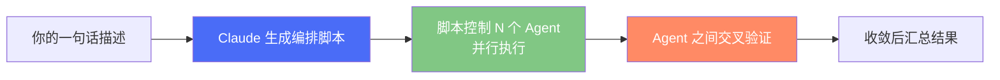
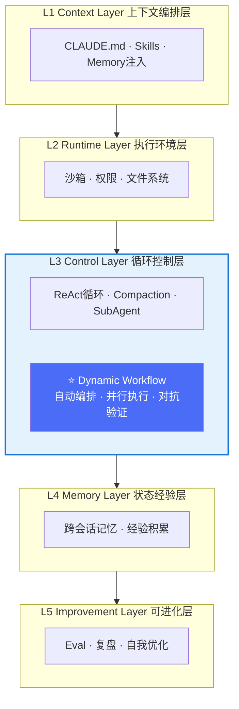
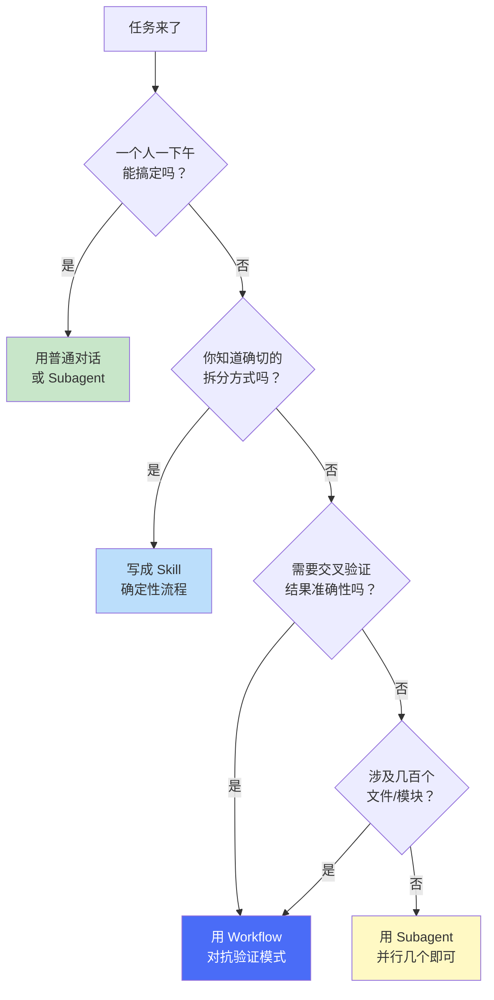
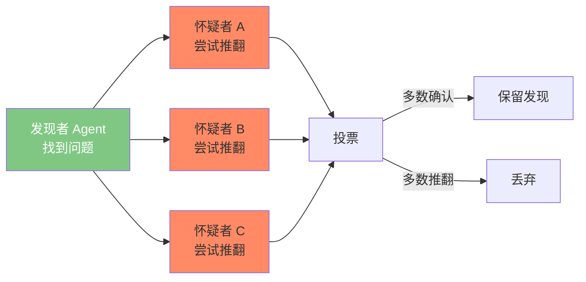

# Module 9: Dynamic Workflows — Harness的自动化引擎

> **核心理解：Workflow 不替代 Harness，它是 Harness 控制层（L3）的一次质的飞跃——把"人来编排 Agent"变成了"脚本自动编排 Agent"。**

## 9.1 什么是 Dynamic Workflow

2026年5月28日，Anthropic 发布了 Claude Code Dynamic Workflows（研究预览）。一句话定义：

> **Dynamic Workflow = Claude 自动生成的 JavaScript 编排脚本，能调度几十到上百个子 Agent 并行工作，并在交付前自动交叉验证结果。**



### 与之前方式的本质区别

|  | 传统方式（Subagents） | Dynamic Workflow |
|---|---|---|
| **谁在编排** | Claude 自己（逐轮决策） | 生成的脚本（确定性执行） |
| **中间结果存哪** | Claude 的上下文窗口 | 脚本变量（不占你的上下文） |
| **规模** | 每轮几个任务 | 最多 1000 个 Agent |
| **可重复性** | 看 Claude 当时心情 | 脚本可保存、可复用 |
| **中断恢复** | 重头开始 | 从断点续跑 |

**关键范式转变：**

> 在标准 Claude Code 中，Claude **是**编排者——它逐轮决定下一步做什么。
> 在 Dynamic Workflow 中，生成的 JavaScript 脚本**是**编排者——Claude 写剧本，运行时按剧本执行。

## 9.2 Workflow 在 Harness 五层架构中的位置

回顾 Module 0 中的五层模型：



### Workflow 解决了什么？没解决什么？

| Harness 层 | Workflow 是否覆盖 | 说明 |
|---|---|---|
| L1 上下文层 | ❌ 不覆盖 | 你仍需要 CLAUDE.md 告诉 Agent 项目是什么 |
| L2 运行时层 | ❌ 不覆盖 | 权限、沙箱仍需你配置 |
| **L3 控制层** | ✅ **大幅强化** | 自动编排、并行、对抗验证、断点续跑 |
| L4 记忆层 | ⚠️ 部分 | 单次运行内有状态，但不跨会话持久化 |
| L5 改进层 | ⚠️ 部分 | 对抗验证提升质量，但没有长期 Eval 循环 |

**结论：Workflow 极大强化了 L3，但 L1、L2 仍然需要你手动搭建。**

这意味着：
- **有 Workflow 没 Harness**：Agent 很多但不知道项目规范，"高效地犯错"
- **有 Harness 没 Workflow**：Agent 理解项目但只能单线程干活，"正确但很慢"
- **Harness + Workflow**：Agent 理解项目规范 + 并行高效执行 + 自动验证 = 最佳

## 9.3 三种编排方式对比：Subagents vs Skills vs Workflows

| 维度 | Subagents | Skills | Dynamic Workflows |
|------|-----------|--------|-------------------|
| **定义** | Claude 临时派出的工人 | Claude 按 Markdown 指令执行 | 脚本驱动的编排引擎 |
| **谁决定下一步** | Claude（逐轮） | Claude（按提示） | 脚本（确定性） |
| **中间结果** | 在 Claude 上下文里 | 在 Claude 上下文里 | 在脚本变量里 |
| **规模** | 每轮几个 | 同 Subagents | 每次最多 1000 个 |
| **可复用** | Worker 定义可复用 | 指令可复用 | **编排本身可复用** |
| **中断处理** | 重新开始 | 重新开始 | **断点续跑** |
| **质量保证** | 靠 prompt | 靠 prompt | **内置对抗验证** |
| **Token 消耗** | 低-中 | 低-中 | **高（可能 10x+）** |

### 什么时候用什么



**经验法则：**
- 💡 **一个文件的修改** → 普通对话
- 💡 **5-10 个相关文件** → Subagent
- 💡 **重复性流程（如部署）** → Skill
- 💡 **跨代码库审计/迁移/深度研究** → Workflow

## 9.4 Workflow 的核心质量模式

Workflow 最大的价值不仅是"更多 Agent"，而是引入了几种**结构化质量模式**——这些模式以前需要人工设计，现在被自动化了。

### 模式一：对抗验证（Adversarial Verify）



**原理**：找到一个问题后，不是直接报告，而是派多个独立 Agent 去**尝试推翻**它。只有经受住质疑的发现才会呈现给你。

**效果**：消除了 AI "看起来很对但其实是幻觉"的发现。

### 模式二：多角度发散（Multi-Modal Sweep）

多个 Agent 从**不同角度**搜索同一个问题，各自看不到对方的结果。

适用于：深度研究、Bug 搜索、安全审计。

### 模式三：收敛循环（Loop-Until-Dry）

不断派出 Agent 搜索，直到连续 N 轮都找不到新内容为止。

适用于：未知规模的发现任务（"到底有多少 Bug？"）。

### 模式四：评委团（Judge Panel）

从不同角度生成 N 个独立方案，然后让评委 Agent 打分，从最佳方案中综合。

适用于：设计决策、架构选型。

## 9.5 脚本语法速览

Workflow 的编排脚本是纯 JavaScript，核心 API：

```javascript
// 元信息（必须）
export const meta = {
  name: 'security-audit',
  description: '全代码库安全审计',
  phases: [
    { title: '扫描', detail: '并行扫描所有模块' },
    { title: '验证', detail: '对抗验证每个发现' },
  ],
}

// 阶段标记
phase('扫描')

// 派出单个 Agent
const result = await agent('扫描 src/auth/ 的认证漏洞', {
  schema: FINDINGS_SCHEMA,  // 结构化输出
  label: 'auth-scan',       // 显示标签
  phase: '扫描',            // 归属阶段
})

// 并行执行（等所有完成后才返回）
const allResults = await parallel([
  () => agent('扫描模块A'),
  () => agent('扫描模块B'),
  () => agent('扫描模块C'),
])

// 流水线（每个 item 独立流过所有阶段，无barrier）
const verified = await pipeline(
  findings,
  f => agent(`验证: ${f.title}`, { schema: VERDICT_SCHEMA }),
  v => agent(`修复建议: ${v.title}`)
)

// 日志
log('已完成扫描阶段，发现 12 个潜在问题')
```

### 关键设计决策

| API | 行为 | 何时用 |
|-----|------|--------|
| `agent()` | 派出一个子 Agent | 任何需要 LLM 做事的场景 |
| `parallel()` | 并行 + 屏障（等所有完成） | 需要收集所有结果后再往下走 |
| `pipeline()` | 并行 + 无屏障（各走各的） | **默认选择**，最快 |
| `phase()` | 标记阶段（用于进度显示） | 组织可视化 |
| `log()` | 发送进度消息 | 让用户知道进展 |

> **官方建议：默认用 `pipeline()`，只有需要跨 item 去重/汇总时才用 `parallel()` 屏障。**

## 9.6 实战使用指南

### 激活方式

| 方式 | 命令 | 说明 |
|------|------|------|
| **关键词触发** | 消息中包含"workflow" | 单次触发，最简单 |
| **Ultracode 模式** | `/effort ultracode` | 所有任务自动 Workflow |
| **内置命令** | `/deep-research 问题` | 深度研究专用 |
| **已保存命令** | `/<你保存的名字>` | 复用之前的 Workflow |

### 管理正在运行的 Workflow

```
/workflows          # 列出所有运行中/已完成的 workflow
```

| 按键 | 操作 |
|------|------|
| `↑` / `↓` | 选择阶段或 Agent |
| `Enter` / `→` | 展开查看详情 |
| `Esc` | 返回上层 |
| `p` | 暂停 / 恢复 |
| `x` | 停止选中的 Agent 或整个 Workflow |
| `r` | 重启选中的 Agent |
| `s` | **保存为可复用命令** |

### 保存为命令

在 `/workflows` 视图中按 `s`，可以保存到：
- `.claude/workflows/`（项目级，团队共享）
- `~/.claude/workflows/`（个人级，所有项目可用）

保存后，以后直接 `/<name>` 就能运行同样的编排逻辑。

## 9.7 成本与风险

### Token 消耗警告

| 场景 | 预估消耗 |
|------|----------|
| 普通对话 | 1x |
| 用 Subagent | 2-5x |
| 小规模 Workflow（10 个 Agent） | 10-20x |
| 大规模 Workflow（100+ Agent） | 50-100x |

> ⚠️ **有用户报告在 $200/月的 Max 计划上，一天就消耗了 20% 的周限额。**
> ⚠️ **Pro 用户报告约 10 分钟就达到上限。**

### 什么时候不该用 Workflow

- ❌ 单文件修改
- ❌ 模糊的需求（"帮我优化一下代码"）
- ❌ 日常编码工作
- ❌ 你已经知道确切步骤的重复性任务（用 Skill 更划算）

**经验法则**：如果这个任务你会交给一个工程师一下午搞定，不要召唤一群 Agent。

## 9.8 Workflow + Harness 的最佳实践

### 实践一：先布 Harness，再用 Workflow

```
❌ 错误顺序：直接 /effort ultracode → Agent 不懂项目规范 → 高效地犯错
✅ 正确顺序：先写 CLAUDE.md → 配权限 → 再用 Workflow → Agent 按规范并行
```

每个 Workflow 子 Agent 启动时都会读取项目的 CLAUDE.md。如果你的 CLAUDE.md 写得好，100 个 Agent 都会遵守你的规范。如果没有 CLAUDE.md，100 个 Agent 各干各的。

### 实践二：Workflow 前先预设权限

Workflow 中的子 Agent 运行在 `acceptEdits` 模式（自动接受文件编辑），但 shell 命令和 MCP 工具可能会中断你确认权限。

**在大规模 Workflow 前**，把需要的命令加入 allowlist：

```json
// .claude/settings.json
{
  "permissions": {
    "allow": [
      "Bash(grep:*)",
      "Bash(find:*)",
      "Bash(pnpm test:*)",
      "Bash(pnpm lint:*)"
    ]
  }
}
```

### 实践三：保存好用的 Workflow 为命令

当一个 Workflow 跑出了好结果，立刻按 `s` 保存。命名建议：

```
security-audit    → 安全审计
migration-check   → 迁移前检查
pr-review         → PR 多维度审查
dead-code-sweep   → 死代码清理
```

这些保存的 Workflow 就是你的**可复用 Harness 组件**。

### 实践四：用 Ultracode 做三阶段工作流

Ultracode 模式下，Claude 会自动把任务拆成多个 Workflow 串行执行：

```
理解（Understand）→ 变更（Change）→ 验证（Verify）
```

1. **理解阶段**：并行读取所有相关文件，建立上下文
2. **变更阶段**：并行修改所有目标文件
3. **验证阶段**：并行运行测试、lint、类型检查

这个"理解→变更→验证"循环，本质上就是自动化的 Harness L3 控制层。

## 9.9 真实案例

### Bun Zig→Rust 重写（750,000行）

1. 一个 Workflow 映射了 Zig 代码库中每个结构体的 Rust lifetime
2. 下一个 Workflow 逐文件编写行为等价的 .rs 文件
3. 修复循环驱动构建和测试直到全部通过
4. 一个过夜的 Workflow 处理不必要的数据拷贝，为每个优化开 PR

**结果：11 天从首次提交到合并，99.8% 测试通过。**

### Klarna 死代码清理

Workflow 并行扫描代码库，识别出传统静态分析工具无法发现的死代码和清理机会。

### `/deep-research` 深度研究

内置 Workflow 的工作方式：
1. 从多个角度并行搜索
2. 获取并交叉对比来源
3. 对每个声明进行内部投票
4. 只保留经受住对抗验证的结论

## 9.10 Workflow 对 Harness 理论的影响

### 回到 Module 0 的核心公式

> **Harness Engineering = 用确定性包裹概率性**

Workflow 完美体现了这个公式：
- **概率性**：每个子 Agent 的输出是概率性的（可能犯错）
- **确定性**：编排脚本是确定性的（固定的流程、验证逻辑）
- **包裹**：脚本控制 Agent 何时执行、结果如何验证、是否保留

### Harness 演进路径更新

| 阶段 | 核心能力 | 代表 |
|------|----------|------|
| Prompt Engineering | 写好一句话 | 单次问答 |
| Context Engineering | 管好 Agent 看什么 | CLAUDE.md、Skills |
| Harness Engineering | 系统化约束和验证 | 权限、Hooks、Eval |
| **Workflow Engineering** | **自动编排和对抗验证** | **Dynamic Workflows** |
| AI Factory | 组织级系统化交付 | 团队协作、流程标准化 |

### 新的关系公式

```
AI Factory ⊃ Workflow Engineering ⊃ Harness Engineering ⊃ Context Engineering ⊃ Prompt Engineering
```

**Workflow Engineering 是 Harness Engineering 的自动化升级**——它没有取消 Harness 的其他层（上下文、运行时、记忆、改进），而是把控制层从"人工编排"升级为"脚本编排"。

## 9.11 行动建议

### 立即可以做的

1. **更新 Claude Code** 到 2.1.154+（`claude update`）
2. **试一次** `/deep-research`，体验 Workflow 的运行方式
3. **确保你的主要项目有 CLAUDE.md**（Workflow 子 Agent 会读取它）

### 短期（本周）

4. 对你最大的项目跑一次：`Run a workflow to audit this codebase for security issues`
5. 如果结果好，按 `s` 保存为命令
6. 把需要的 shell 命令加入项目 allowlist

### 中期（本月）

7. 为团队常见操作（PR Review、安全审计、迁移检查）各保存一个 Workflow
8. 这些保存的 Workflow = 你的**自动化 Harness 组件库**
9. 在 CLAUDE.md 中记录哪些任务适合用 Workflow，哪些不适合

> **记住：Workflow 是一个强大的新工具，但它是 Harness 体系中的一个组件，不是替代品。好的 Harness + Workflow = 既正确又高效。**
