# 飞书 CLI（lark-cli）完全指南

> 一本面向所有岗位（产品、运营、研发、销售、HR、行政、客户成功……）的飞书 CLI 使用手册。
>
> 你不需要会写代码，只需要会复制粘贴、会跟着步骤敲命令，就能让 AI 帮你接管 80% 的"在飞书里点来点去"的重复工作。
>
> 本文配套来源：
> - 官方仓库：[github.com/larksuite/cli](https://github.com/larksuite/cli)（MIT 开源 · 已 1.7k+ Star）
> - 官方文档：[feishu-cli.com](https://feishu-cli.com/zh/)
> - 飞书开放平台：[open.feishu.cn](https://open.feishu.cn/)
> - 个人知识库源稿：[wiki/reference/AI 工具与工程实践/06_飞书CLI](https://github.com/larksuite/cli)
>
> 适用版本：lark-cli v1.0.32+（本文以 2026 年 4 月版本为基准）

---

## 目录

- [一、先看一张图：飞书 CLI 到底是什么](#一-先看一张图-飞书-cli-到底是什么)
- [二、为什么是"现在"开始用它](#二-为什么是-现在-开始用它)
- [三、谁应该看这篇文章（按岗位拆解）](#三-谁应该看这篇文章-按岗位拆解)
- [四、核心概念：三层命令架构](#四-核心概念-三层命令架构)
- [五、安装手册（5 分钟完成）](#五-安装手册-5-分钟完成)
- [六、授权与配置（OAuth 全流程）](#六-授权与配置-oauth-全流程)
- [七、第一次跑通：从 0 到第一条飞书消息](#七-第一次跑通-从-0-到第一条飞书消息)
- [八、核心命令全景：12 大业务域](#八-核心命令全景-12-大业务域)
- [九、AI Agent Skills：让 Claude / Codex / Windsurf 接管飞书](#九-ai-agent-skills-让-claude--codex--windsurf-接管飞书)
- [十、10 个开箱即用的实战工作流](#十-10-个开箱即用的实战工作流)
- [十一、进阶技巧：输出格式、分页、身份切换、Dry-Run](#十一-进阶技巧)
- [十二、安全边界与最小权限策略](#十二-安全边界与最小权限策略)
- [十三、故障排查（FAQ）](#十三-故障排查-faq)
- [十四、延伸阅读与社区资源](#十四-延伸阅读与社区资源)

---

## 一、先看一张图：飞书 CLI 到底是什么

### 1.1 你可能已经在用智能伙伴 / 智能体了——那为什么还要看 CLI？

如果你在飞书生态里，大概率早就接触过**飞书智能伙伴**（My AI）和**智能体**（Aily 等飞书原生 Agent）。
公司里不少同事已经把它们用得很深、很好：让智能伙伴写日报、改文档；让智能体管 OKR、跟项目、做客户对话分析；甚至让智能体在群里值班。**这条路是对的，先继续用、用熟。**

那为什么还要再看一眼"飞书 CLI"？因为它和智能伙伴**不是替代关系，是补位关系**。它们解决的是两个不同问题：

<div class="diagram-row">

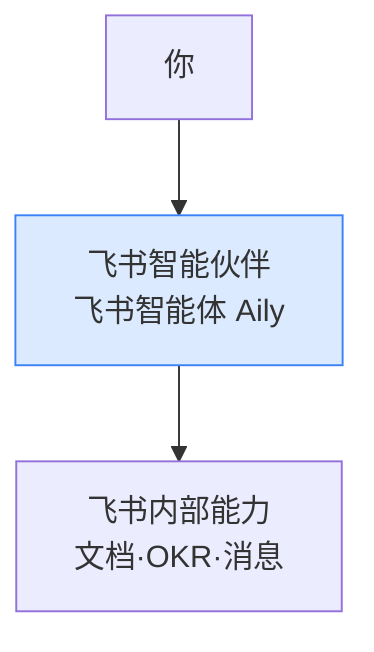

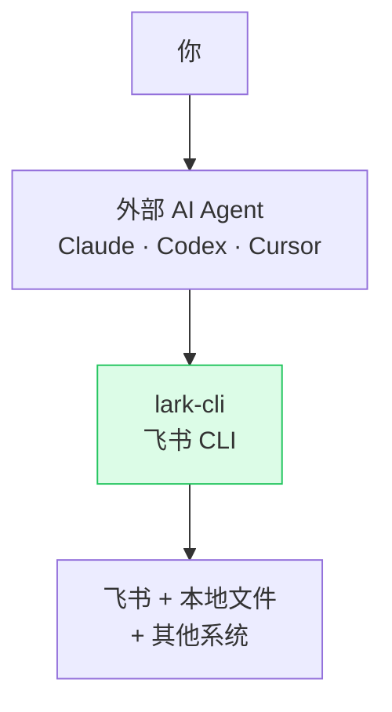

</div>

一句话区分：

| 维度 | 飞书智能伙伴 / 智能体 | 飞书 CLI + 外部 Agent |
|---|---|---|
| **运行位置** | 飞书云端 | 你的电脑 / 服务器 |
| **触发方式** | 飞书 App 内点选、@、对话 | 终端 / IDE / Claude Code 自然语言 |
| **能力边界** | 飞书内部功能为主 | 飞书 + **本地文件** + **任意外部系统** |
| **可编排深度** | 在 Aily 里搭"画布"，有限自由 | 任何能跑命令的地方都能编排 |
| **代码生产力** | 不擅长（不是定位） | 极强（IDE 里直接边写代码边操作飞书） |
| **可审计性** | 平台日志 | 你电脑上的命令历史，逐条可回放 |
| **安全控制** | 企业管理员统一管 | 你本地 OAuth Token + 钥匙串 |

简单一句话：

> **智能伙伴 / 智能体 = 飞书把"AI"放进了飞书；CLI = 你把"飞书"放进了 AI。**
>
> 前者优势在飞书内部场景一站式打通；后者优势在让 Cursor / Claude Code / Codex 这种"代码生产力 Agent"把飞书当成可调用工具，混合操作"飞书 + Git 仓库 + 本地文档 + 第三方系统"。

### 1.2 两者具体在哪些事上分工不同

下面这张图横向并列，告诉你"哪些事让智能伙伴做、哪些事让 CLI 做、哪些事两者配合做"——**这是这篇文章的核心定位**：

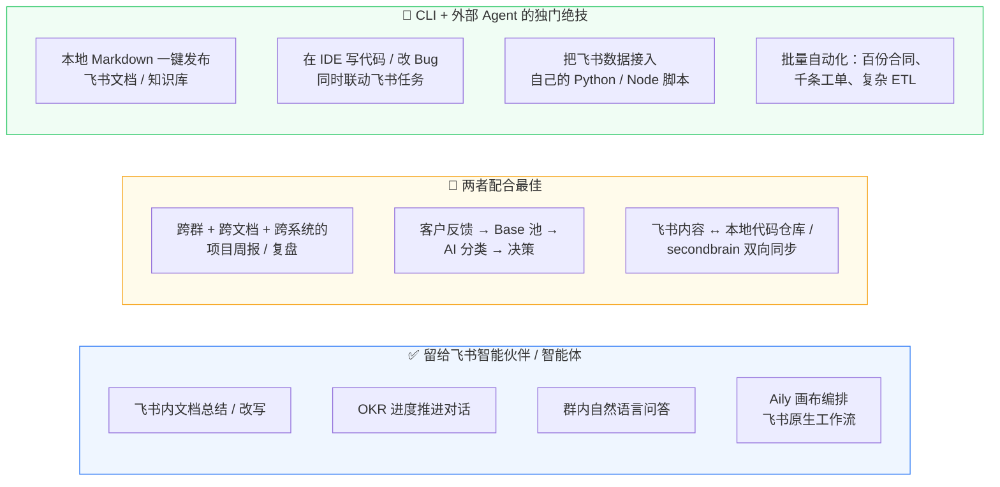

### 1.3 两个更现实的对比例子（替代"60 秒"那种"非黑即白"的故事）

**例子 A：周一上午写一份"上周项目周报"**

- 用智能伙伴：在飞书里 @ 智能伙伴 → "帮我总结上周的会议纪要" → 它给你一段文字 → 你手动整理到周报模板里 → 还得自己去翻群消息和 Base 里的任务状态。**很快，但天花板是飞书内部信息。**
- 用 CLI + Claude Code：在 IDE 里说一句"读上周妙记、项目群消息和 Base 任务表，结合本地 secondbrain 里的项目模板生成周报草稿，发到周报知识库，并把行动项写回任务表"。**Claude Code 串起 5–6 个步骤，1 分钟交付，跨系统数据全打通。**

两个都能用。前者更轻、更"在飞书里"；后者更重、更"跨系统"。**选什么取决于本周的数据是不是都在飞书内**。

**例子 B：客户反馈进入多维表格再做分类决策**

- 智能体（Aily）：可以做，但你需要在 Aily 画布里搭一个流程，调用飞书内的反馈来源、调用 LLM 节点、写入 Base。学习曲线在 Aily 自身。
- CLI + Codex：本地一个 30 行脚本：`lark-cli im +chat-messages-list` 取群里反馈 → 让 Codex 做分类 → `lark-cli base records batch_create` 写入 Base。**改一行代码就能加新来源（邮件、表单、CSV、CRM 导出）**。

> 结论：**不是非此即彼**。智能伙伴负责飞书内部"对话即可达成"的事；CLI 负责飞书外部"要写一点点逻辑、要打通别的系统、要在 IDE 里和代码一起做"的事。

### 1.4 高阶能力一览：CLI + 外部 Agent 能做、智能伙伴不擅长的事

下面这张图（横向，避免占满屏）列出 CLI 真正的"高阶玩法"，以及每件事对应什么岗位、需要搭配哪种外部 Agent 工具：

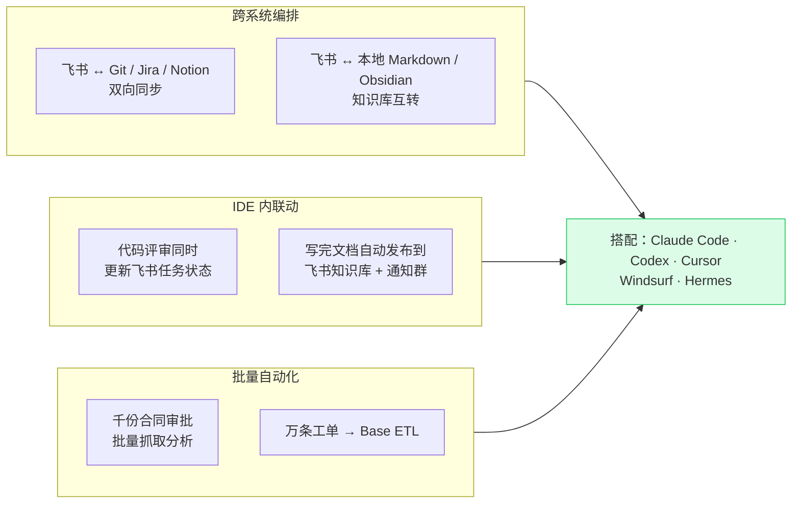

**岗位 × 高阶用法 × 推荐 Agent 工具**：

| 岗位 | 高阶用法 | 推荐外部 Agent |
|---|---|---|
| **产品经理** | 把"群里反馈 + 飞书文档 + Jira 工单"拉到一处做需求池分析 | Claude Code / Codex |
| **研发 / SRE** | IDE 里 commit 完代码，Cursor 顺手把任务、文档、群通知都改好 | Cursor / Claude Code |
| **项目经理** | 多项目周报：跨 5+ 群消息 + 妙记 + Base 任务 + secondbrain 模板一键生成 | Claude Code |
| **运营 / 增长** | 多渠道反馈（飞书群、邮件、CSV、表单）→ AI 分类 → Base 池 → 决策看板 | Codex / Claude Code |
| **销售 / BD** | 客户对话纪要 → 商机字段更新 + 跟进任务批量创建 | Claude Code |
| **HR / 行政** | 招聘日程多角色协调；onboarding 文档批量生成 + 自动入库 | Codex |
| **客户成功** | 工单关键词实时事件订阅（`lark-cli event`）→ 高优工单自动升级 | Claude Code + 定时调度 |
| **数据 / 分析** | 飞书 Base / Sheets 当数据源，本地 Python 做 ETL，分析结果回写文档 | Codex / Cursor |
| **一人公司 / 自由职业者** | 多客户多账号统一看板；secondbrain 内容批量发布到不同客户飞书空间 | Claude Code |

### 1.5 一张更准确的"它在哪一层"图

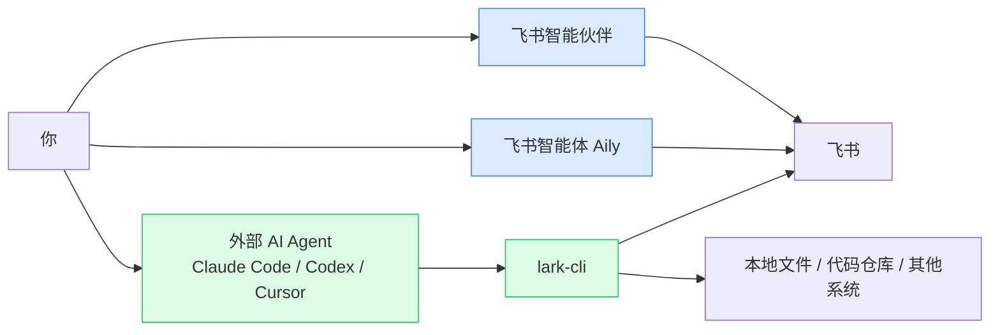

到这里你应该已经有判断：

- **如果你只在飞书里办公，且任务能用对话完成：先用智能伙伴 / Aily，省事。**
- **如果你的任务涉及"代码 / 本地文件 / 第三方系统 / 复杂批处理 / IDE 协作"：必须上 CLI + 外部 Agent。**
- **大多数严肃的项目交付场景，两者都会用上。**

下面所有章节都围绕"CLI + 外部 Agent"这条线展开。智能伙伴 / Aily 不是本文重点（飞书官方文档已经讲得很好），需要时移步 [飞书智能伙伴官方介绍](https://www.feishu.cn/hc/zh-CN/articles/360054572593) 与 [飞书智能体 Aily 平台](https://www.feishu.cn/product/ai)。

---

## 二、为什么是"现在"开始用它

飞书 CLI 是 2026 年 3 月 28 日由飞书官方在 GitHub 正式开源的（[larksuite/cli](https://github.com/larksuite/cli)）。第一天 GitHub Star 破千，一周内突破 1.7k。

它和过去的"飞书 SDK"、"飞书 Bot"有什么本质区别？三句话讲清楚：

| 维度 | 老的 SDK / Bot | 飞书 CLI |
|---|---|---|
| **谁是用户** | 程序员 | 程序员 + **AI Agent** + **普通人** |
| **怎么用** | 写代码 → 调用 SDK | 命令行 / 让 AI 调用 |
| **覆盖范围** | 某个业务域（比如 IM） | 11 大业务域 + 2500+ API 全覆盖 |
| **学习成本** | 高（要懂 OAuth、SDK API） | 低（看说明书 / 让 AI 看说明书） |
| **可审计** | 弱（散落在代码里） | 强（每一步都是一条命令） |

更重要的：飞书 CLI 自带 **26 个 AI Agent Skills**，把"AI 怎么使用每个命令、每个最佳实践、每个坑"打包成结构化知识，让任何支持 [Anthropic Skills 协议](https://github.com/anthropics/skills) 的 Agent（Claude Code、Codex、Cursor、Windsurf、Hermes）**装上即用**。

它真正的革命性在于：**第一次，让"非程序员"能 100% 享受到飞书 OpenAPI 的能力**。

---

## 三、谁应该看这篇文章（按岗位拆解）

用一张紧凑的表替代大思维导图：

| 岗位 | 4 个典型用法 |
|---|---|
| **产品经理** | 需求池自动维护 · 竞品反馈分析 · 纪要转 PRD 行动项 · 跨群周报 |
| **运营 / 增长** | 反馈进 Base · 活动数据日报 · Markdown→飞书 · KOL 对话整理 |
| **研发 / 工程** | Bug 单同步 Base · 代码评审纪要 · 项目台账 · Schema 集成 |
| **销售 / BD** | 客户群信息提取 · 拜访纪要转文档 · 商机台账 · 跟进任务批量建 |
| **HR / 行政** | 面试日程自动协调 · onboarding 文档 · 考勤导出 · 培训反馈分析 |
| **客户成功 / 售后** | 工单日报 · 客户群风险预警 · 问题分类台账 · 满意度调研 |
| **财务 / 法务** | 合同审批数据导出 · 报销表抓取 · 流程效率分析 · OKR 抽取 |
| **一人公司 / 自由职业者** | 多客户群看板 · 纪要→交付文档 · Markdown→飞书 · 项目 Base |

如果你属于其中任何一类，这篇文章都值得收藏。如果你不属于但你的同事属于，请把这篇文章转发给他。

---

## 四、核心概念：三层命令架构

理解飞书 CLI 的命令体系，是理解它为什么"好用"的关键。


### 4.1 第一层：快捷命令（`+` 前缀）

这一层是飞书 CLI 团队精心设计的"开箱即用快捷方式"。

特点：
- 命令以 `+` 开头：如 `+agenda`、`+messages-send`、`+create`
- 自带智能默认值
- 输出已经做过"人类可读"的格式化
- AI Agent 第一时间会选择这一层

例子：

```bash
# 看今天的日程
lark-cli calendar +agenda

# 发一条群消息
lark-cli im +messages-send --chat-id "oc_xxx" --text "Hello"

# 新建一篇飞书文档
lark-cli docs +create --doc-format markdown --content "# 周报"

# 搜消息
lark-cli im +messages-search --query "需求"

# 搜群
lark-cli im +chat-search --query "项目"
```

记住：**优先用这一层。** 它是为"人 + AI"设计的。

### 4.2 第二层：API 命令

当 `+` 命令解决不了你的需求时（比如要传一些复杂参数），降到第二层。这一层与飞书开放平台的 API 路径基本一一对应。

例子：

```bash
# 列出某个多维表格的记录
lark-cli base records list \
  --params '{"app_token":"bascnXXX","table_id":"tblXXX"}'

# 给某个文档加评论
lark-cli docs comments create \
  --params '{"file_token":"...","file_type":"docx"}' \
  --data '{"content":"请审阅"}'
```

格式相对原始，但能精确控制每个字段。

### 4.3 第三层：通用 API 调用（终极兜底）

如果上述两层都没覆盖到你想做的事情，第三层让你直接调用 **2500+ 飞书开放 API 中的任何一个**：

```bash
# GET
lark-cli api GET /open-apis/calendar/v4/calendars

# POST
lark-cli api POST /open-apis/im/v1/messages \
  --params '{"receive_id_type":"chat_id"}' \
  --data '{"receive_id":"oc_xxx","msg_type":"text","content":"{\"text\":\"hello\"}"}'
```

这意味着：**只要飞书官方 API 支持，飞书 CLI 就能做到**。

> ⚠️ 普通用户和大多数 AI Agent 99% 的时间只会停留在第一层。第三层是给"我有非常具体的、上层封装没覆盖的需求"的人准备的兜底。

---

## 五、安装手册（5 分钟完成）

### 5.1 前置要求

只需要一件事：**Node.js v18+**。

如果你的电脑没装 Node.js，按以下步骤来。

**Mac 用户**（推荐用 Homebrew）：

```bash
# 检查是否有 brew
brew --version
# 如果没有，先装 brew
/bin/bash -c "$(curl -fsSL https://raw.githubusercontent.com/Homebrew/install/HEAD/install.sh)"
# 装 Node
brew install node@20
```

**Windows 用户**：

下载 [Node.js 官方安装包](https://nodejs.org/zh-cn/download)，选 LTS 版本（v20.x），双击安装即可。

**Linux 用户**：

```bash
curl -fsSL https://deb.nodesource.com/setup_20.x | sudo -E bash -
sudo apt-get install -y nodejs
```

验证：

```bash
node --version
# 应当输出 v18 或以上
npm --version
```

### 5.2 安装飞书 CLI

```bash
# 一行命令
npm install -g @larksuite/cli
```

如果你在 Mac 上遇到权限错误，加 `sudo`：

```bash
sudo npm install -g @larksuite/cli
```

验证：

```bash
lark-cli --version
# 应输出：lark-cli version 1.0.32（或更高）
```

### 5.3 安装 AI Agent Skills（强烈推荐）

如果你打算让 Claude Code、Codex、Cursor 或 Windsurf 来"驾驶" CLI，**这一步是关键**。

```bash
npx skills add larksuite/cli -y -g
```

这条命令会把 26 个 `lark-*` Skills 装到 `~/.agents/skills/`，让所有支持 Skills 协议的 AI Agent 自动看到这些技能包。

要单独装某一类：

```bash
# 只装日历相关
npx skills add larksuite/cli -s lark-calendar -y

# 只装 IM 相关
npx skills add larksuite/cli -s lark-im -y
```

### 5.4 健康检查

```bash
lark-cli doctor
```

如果你刚装好还没授权，会显示 `auth: not configured`。这是正常的。接下来我们做授权。

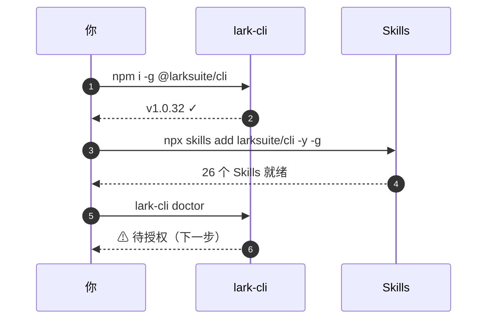

---

## 六、授权与配置（OAuth 全流程）

授权是飞书 CLI 唯一需要"动点脑子"的环节。但只需要做一次，之后 6 个月不用管。

### 6.1 整体流程一张图

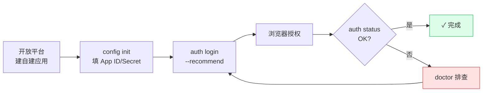

### 6.2 步骤 1：创建一个飞书自建应用

打开 [飞书开放平台 → 开发者后台](https://open.feishu.cn/app)，点"创建企业自建应用"。

填写：
- **应用名称**：`Lark CLI - 个人助手`（任意，自己看的）
- **应用描述**：`通过 lark-cli 让 AI Agent 操作飞书`
- **应用图标**：随便传一个

创建后，记下两个值：
- **App ID**（形如 `cli_xxxxxxxxxxxxxxxx`）
- **App Secret**（形如 `xxxxxxxxxxxxxxxxxxxxxxxxxxxxxxxx`）

> ⚠️ App Secret 是密钥，不要发到任何聊天、Git 仓库、博客文章里。后面 CLI 会把它加密存到 macOS Keychain / Linux Secret Service。

### 6.3 步骤 2：配置 CLI

```bash
lark-cli config init --new
```

按提示输入 App ID 和 App Secret。完成后会写入 `~/.config/lark-cli/config.toml`（注意：Secret 不会明文存这里，而是存进系统钥匙串）。

### 6.4 步骤 3：OAuth 授权登录

```bash
lark-cli auth login --recommend
```

`--recommend` 表示"申请一组合理的推荐权限"（覆盖日历、消息、文档、Base、知识库、任务、邮箱、通讯录等常见域）。

执行后会：
1. 在终端打印一个 URL
2. 自动打开浏览器（如果失败，复制 URL 手动粘贴）
3. 浏览器跳转到飞书授权页，让你确认要授予哪些范围
4. 你点"同意"
5. 终端自动收到 token，提示成功

如果你只想授权某个细分域：

```bash
# 只授权日历相关
lark-cli auth login --domain calendar

# 多个域
lark-cli auth login --domain calendar,im,docs
```

### 6.5 步骤 4：验证

```bash
lark-cli auth status
```

应显示当前用户、租户、已授权权限范围。

```bash
lark-cli doctor
```

所有项都应是 ✓。

### 6.6 切换身份：用户 vs 机器人

飞书 CLI 支持两种身份执行操作：

| 身份 | `--as` 标志 | 用途 |
|---|---|---|
| 用户身份 | `--as user`（默认） | 以"你"的名义操作，看到的就是你能看到的 |
| 机器人身份 | `--as bot` | 以"应用机器人"名义操作，能在群里以 Bot 身份发言 |

例如：

```bash
# 以你本人发消息
lark-cli im +messages-send --chat-id oc_xxx --text "Hi" --as user

# 以机器人发消息（这条消息会显示是 Bot 发的）
lark-cli im +messages-send --chat-id oc_xxx --text "通知" --as bot
```

### 6.7 多账号 / 多 Profile

如果你同时管理多个飞书租户（比如自己公司 + 客户公司），用 profile：

```bash
# 创建一个新 profile
lark-cli profile create --name client-a

# 切换
lark-cli profile use client-a

# 也可以在单条命令上指定
lark-cli --profile client-a calendar +agenda
```

---

## 七、第一次跑通：从 0 到第一条飞书消息

让我们用一个最小可行的端到端任务，验证整套系统能跑通。

**目标**：给自己发一条飞书消息。

### 7.1 找到自己的 user_id 或 chat_id

```bash
# 用名字搜自己
lark-cli contact +search-user --query "你的名字"
```

输出大概是：

```json
{
  "users": [
    {
      "name": "Mike",
      "open_id": "ou_xxxxxxxxxxxxxxxxxxxxxxxx",
      "user_id": "xxxxxxxx",
      "email": "mike@example.com"
    }
  ]
}
```

记下 `open_id` 或 `user_id`。

### 7.2 发送一条消息

```bash
lark-cli im +messages-send \
  --user-id "ou_xxxxxxxxxxxxxxxxxxxxxxxx" \
  --text "Hello from lark-cli 🎉"
```

如果你打开飞书，应该已经收到这条消息了。**第一次跑通，恭喜你。**

### 7.3 发到群里

```bash
# 先搜群
lark-cli im +chat-search --query "测试群" --format pretty

# 拿到 chat_id 后
lark-cli im +messages-send \
  --chat-id "oc_xxxxxxxxxxxxxxxxxxxxxxxx" \
  --text "Hello team!"
```

### 7.4 用 Dry-Run 安全预览

执行有副作用的命令前，加 `--dry-run` 看看会发生什么但不真发：

```bash
lark-cli im +messages-send \
  --chat-id "oc_xxx" \
  --text "重要通知：今晚 8 点全员加班" \
  --dry-run
```

输出会告诉你"如果真发，会发到哪个群、内容是什么"，但不会真发。**养成这个习惯，能避免 99% 的事故。**

---

## 八、核心命令全景：12 大业务域

下面我们按业务域系统地过一遍。你不需要全部记住——只需要知道"飞书里我能做的几乎所有事，CLI 都能做"。

命令域按"沟通 / 内容 / 数据 / 调度 / 治理"五类一目了然：

| 分组 | 命令域 |
|---|---|
| 沟通协作 | `im` 消息 · `mail` 邮箱 · `contact` 通讯录 |
| 内容创作 | `docs` 文档 · `markdown` MD互转 · `wiki` 知识库 · `slides` 演示 · `whiteboard` 白板 · `drive` 云空间 |
| 数据生产 | `base` 多维表格 · `sheets` 电子表格 |
| 时间调度 | `calendar` 日历 · `vc` 会议 · `minutes` 妙记 · `task` 任务 · `attendance` 考勤 |
| 流程治理 | `approval` 审批 · `okr` 目标 · `event` 实时事件 |

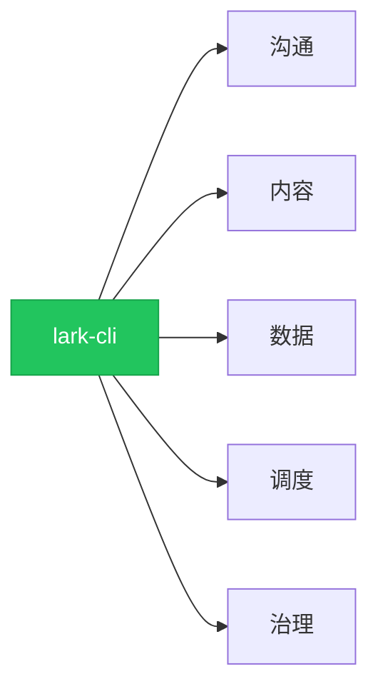

### 8.1 `im`：消息与群聊

最常用的一类。

```bash
# 搜群
lark-cli im +chat-search --query "客运" --format pretty

# 列出我加入的所有群
lark-cli im +chat-list --page-all

# 拉某个群最近 30 条消息
lark-cli im +chat-messages-list \
  --chat-id "oc_xxx" \
  --sort desc \
  --page-size 30 \
  --format pretty

# 拉指定时间段
lark-cli im +chat-messages-list \
  --chat-id "oc_xxx" \
  --start "2026-05-23T00:00:00Z" \
  --sort asc \
  --page-size 50 \
  --format json | jq '.data.messages[] | {sender:.sender.name, time:.create_time, content:.content}'

# 发送 Markdown 富文本
lark-cli im +messages-send \
  --chat-id "oc_xxx" \
  --markdown "# 周报\n\n- 项目 A 进展 80%\n- 风险：人力不足"

# 全局搜消息
lark-cli im +messages-search --query "需求" --format pretty

# 回复某条消息
lark-cli im +messages-reply \
  --message-id "om_xxx" \
  --text "收到，下午回复"

# 下载消息里的图片/文件
lark-cli im +messages-resources-download \
  --message-id "om_xxx" \
  --file-key "key_xxx" \
  -o ./received/

# 收藏 / 取消收藏（书签）
lark-cli im +flag-create --message-id "om_xxx"
lark-cli im +flag-list --page-all --format pretty
lark-cli im +flag-cancel --message-id "om_xxx"
```

### 8.2 `docs`：飞书云文档

```bash
# 创建一篇 Markdown 文档
lark-cli docs +create \
  --doc-format markdown \
  --title "2026 Q2 项目方案" \
  --content "# 背景\n\n# 方案\n\n# 风险"

# 读取一篇文档
lark-cli docs +get --doc-token "doccnXXX" --format pretty

# 列出最近文档
lark-cli docs +list --page-size 20
```

也可以用专门的 `markdown` 命令组：

```bash
# 从本地 Markdown 文件创建飞书文档
lark-cli markdown create --file ./周报.md --title "本周周报"

# 把本地 md 覆盖到一篇已有飞书文档
lark-cli markdown overwrite --file ./新版.md --doc-token "doccnXXX"

# 把飞书文档拉成本地 md
lark-cli markdown fetch --doc-token "doccnXXX" -o ./下载.md
```

> 💡 **这是非程序员最容易低估的杀手锏**：写文章用本地 Markdown 编辑器（如 Obsidian、Typora），写完一条命令推到飞书，排版完美。再也不用在飞书里被那个"半残的所见即所得编辑器"折磨。

### 8.3 `base`：多维表格

多维表格是飞书最强大的功能之一，CLI 让你能把它当数据库用。

```bash
# 列记录
lark-cli base records list \
  --params '{"app_token":"bascnXXX","table_id":"tblXXX"}' \
  --page-all

# 创建记录
lark-cli base records create \
  --params '{"app_token":"bascnXXX","table_id":"tblXXX"}' \
  --data '{"fields":{"任务":"修复登录","负责人":"张三","状态":"进行中"}}'

# 更新记录
lark-cli base records update \
  --params '{"app_token":"bascnXXX","table_id":"tblXXX","record_id":"recXXX"}' \
  --data '{"fields":{"状态":"已完成"}}'

# 批量创建（导入）
lark-cli base records batch_create \
  --params '{"app_token":"bascnXXX","table_id":"tblXXX"}' \
  --data '{"records":[{"fields":{"任务":"A"}},{"fields":{"任务":"B"}}]}'
```

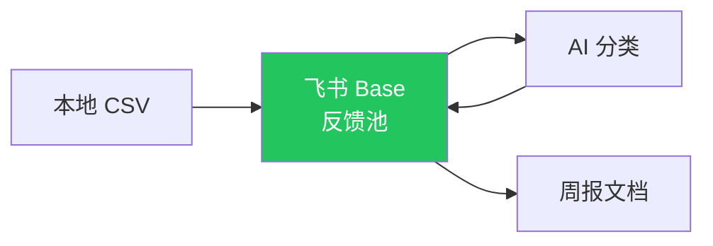

### 8.4 `sheets`：电子表格

```bash
# 读取单元格区域
lark-cli sheets +read \
  --spreadsheet-token "shtcnXXX" \
  --range "Sheet1!A1:D100"

# 追加行
lark-cli sheets +append \
  --spreadsheet-token "shtcnXXX" \
  --range "Sheet1!A:D" \
  --values '[["2026-05-30","客户A","订单","成交"]]'

# 找一个值的位置
lark-cli sheets +find \
  --spreadsheet-token "shtcnXXX" \
  --range "Sheet1!A:A" \
  --query "客户A"
```

### 8.5 `calendar`：日历

```bash
# 今天日程
lark-cli calendar +agenda

# 明天 / 本周
lark-cli calendar +agenda --date tomorrow
lark-cli calendar +agenda --date "this week"

# 创建事件
lark-cli calendar +create \
  --title "方案评审会" \
  --start "2026-06-01T15:00:00+08:00" \
  --end   "2026-06-01T16:00:00+08:00" \
  --attendees "mike@example.com,lisa@example.com" \
  --description "评审 Q3 方案"

# 查忙闲
lark-cli calendar +freebusy \
  --users "mike@example.com,lisa@example.com" \
  --start "2026-06-01T09:00:00+08:00" \
  --end   "2026-06-01T18:00:00+08:00"

# 推荐合适时间
lark-cli calendar +suggest \
  --users "mike@example.com,lisa@example.com" \
  --duration 60 \
  --range "this week"
```

### 8.6 `vc` 和 `minutes`：会议和妙记

```bash
# 列出最近会议
lark-cli vc meetings list --page-size 20

# 获取一个会议的纪要
lark-cli minutes +get --minute-token "obcnXXX" --format pretty

# 搜索会议纪要
lark-cli minutes +search --query "产品评审"

# 下载妙记原文
lark-cli minutes +download --minute-token "obcnXXX" -o ./meeting.md
```

### 8.7 `task`：任务

```bash
# 列出我的任务
lark-cli task tasks list --page-size 50

# 创建任务
lark-cli task tasks create \
  --data '{"summary":"准备评审材料","due":{"timestamp":"1717142400000"}}'

# 添加子任务
lark-cli task subtasks create \
  --params '{"task_guid":"xxx"}' \
  --data '{"summary":"画架构图"}'

# 创建任务清单
lark-cli task tasklists create --data '{"name":"沈阳客运项目"}'
```

### 8.8 `wiki`：知识库

```bash
# 列出所有知识空间
lark-cli wiki spaces list

# 列出某个空间下的节点
lark-cli wiki nodes list --space-id "7xxx" --page-all

# 创建一个节点（文档）
lark-cli wiki nodes create \
  --space-id "7xxx" \
  --data '{"obj_type":"docx","node_type":"origin","title":"05-30 日报"}'

# 把一篇文档移进知识库
lark-cli wiki nodes copy \
  --space-id "7xxx" \
  --data '{"obj_token":"doccnXXX","obj_type":"docx"}'
```

### 8.9 `drive`：云空间

```bash
# 列出文件夹内容
lark-cli drive files list --params '{"folder_token":"fldXXX"}'

# 上传文件
lark-cli drive files +upload --file ./合同.pdf --folder-token "fldXXX"

# 给文件加权限
lark-cli drive permissions +create \
  --token "doccnXXX" \
  --type docx \
  --member "user@example.com" \
  --perm view
```

### 8.10 `mail`：邮箱

```bash
# 列出收件箱
lark-cli mail messages list --params '{"folder":"INBOX"}' --page-size 20

# 搜邮件
lark-cli mail messages +search --query "合同"

# 发邮件
lark-cli mail messages +send \
  --to "client@example.com" \
  --subject "合同已签" \
  --body "请查收附件"

# 列出邮件草稿
lark-cli mail drafts list
```

### 8.11 `contact`：通讯录

```bash
# 按名字搜
lark-cli contact +search-user --query "张三"

# 按邮箱搜
lark-cli contact +search-user --query "zhangsan@example.com"

# 列出部门
lark-cli contact departments list --params '{"parent_department_id":"0"}'
```

### 8.12 `slides` 和 `whiteboard`：演示和白板

```bash
# 创建一个空白演示
lark-cli slides +create --title "Q3 战略汇报"

# 读取演示内容
lark-cli slides +get --slide-token "shtcnXXX"

# 创建白板
lark-cli whiteboard +create --title "需求脑图"
```

### 8.13 其他业务域

- `approval`：审批流程，可查、可发、可处理
- `okr`：拉取目标、关键结果、对齐与进度
- `attendance`：考勤打卡记录查询
- `event`：实时事件订阅（WebSocket），适合做"群里出现关键词就触发自动化"

---

## 九、AI Agent Skills：让 Claude / Codex / Windsurf 接管飞书

这是飞书 CLI 真正的"魔法所在"。

### 9.1 Skills 是什么

[Anthropic Skills 协议](https://github.com/anthropics/skills) 是一个简单的开放规范：每个 Skill 是一个目录，里面有一份 `SKILL.md`，告诉 AI Agent：

> "我能做什么，什么时候触发我，调用时要注意什么。"

飞书 CLI 把"如何用 lark-cli 完成日历管理"、"如何用 lark-cli 跑会议纪要工作流"等 26 类知识打包成 26 个 Skills。

### 9.2 26 个官方 Skills 全清单

| 分类 | Skill | 主要场景 |
|---|---|---|
| 核心 | `lark-shared` | 应用配置、认证、身份切换（自动加载） |
| 业务 | `lark-calendar` | 日历事件、议程、忙闲、会议室、RSVP |
| 业务 | `lark-im` | 消息收发、群聊、搜索、媒体上下载 |
| 业务 | `lark-doc` | 文档增删改查、Markdown 转换 |
| 业务 | `lark-drive` | 云空间、上传下载、权限、评论 |
| 业务 | `lark-sheets` | 电子表格读写、追加、查找、导出 |
| 业务 | `lark-base` | 多维表格、字段、记录、视图、仪表盘 |
| 业务 | `lark-task` | 任务、清单、子任务、提醒 |
| 业务 | `lark-mail` | 邮件浏览、搜索、发送、回复、草稿 |
| 业务 | `lark-contact` | 通讯录按姓名/邮箱/电话查询 |
| 业务 | `lark-wiki` | 知识空间、节点、文档管理 |
| 业务 | `lark-vc` | 视频会议查询、会议记录 |
| 业务 | `lark-minutes` | 妙记内容、元数据获取 |
| 业务 | `lark-okr` | OKR、关键结果、进度查询 |
| 业务 | `lark-slides` | 演示文稿创建和阅读 |
| 业务 | `lark-whiteboard` | 白板创建和编辑 |
| 业务 | `lark-approval` | 审批实例和任务 |
| 业务 | `lark-attendance` | 考勤数据 |
| 业务 | `lark-event` | 实时 WebSocket 事件订阅 |
| 工作流 | `lark-workflow-meeting-summary` | 会议纪要→行动项→飞书文档 |
| 工作流 | `lark-workflow-chat-digest` | 群聊→日报 |
| 工作流 | `lark-workflow-doc-publish` | 本地 Markdown→飞书文档 |
| 工作流 | `lark-workflow-feedback-board` | 反馈→多维表格 |
| 工具 | `lark-skill-maker` | 自定义 Skill 创建辅助 |
| 工具 | `lark-schema-explorer` | API 自省 |
| 工具 | `lark-debug` | 调试、诊断、日志分析 |

### 9.3 安装到不同 Agent

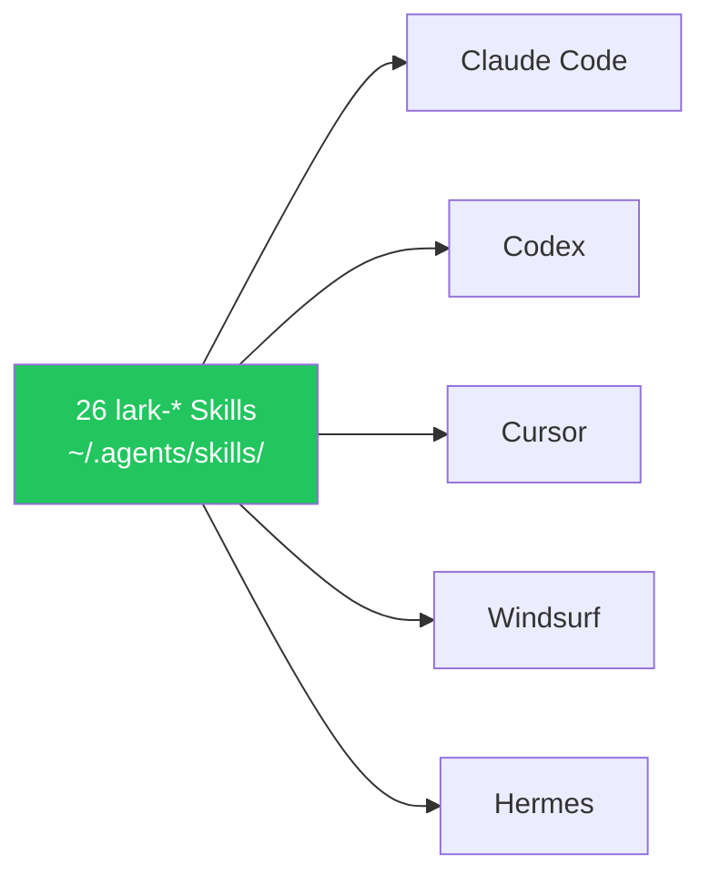

一条命令装到全部：

```bash
npx skills add larksuite/cli -y -g
```

### 9.4 真实对话示例

装好 Skills 后，打开任何 Agent，下面这些自然语言就能直接工作：

**例 1：日程查询**
> 你：明天有什么会议？
>
> Agent：（自动调用 `lark-cli calendar +agenda --date tomorrow`）
> 你明天有 3 个会议：
> 1. 09:00-10:00 与客户 A 的需求沟通
> 2. 14:00-15:00 产品评审
> 3. 16:00-16:30 1on1

**例 2：跨群信息聚合**
> 你：把今天"沈阳客运"和"AI 试点攻坚"两个群里所有提到"风险"的消息整理一下
>
> Agent：（依次调用 `+chat-search` 找 chat_id，再 `+chat-messages-list` 拉消息，再 `jq` 过滤"风险"关键词）
> 整理如下：
> - 09:14 张工：现场设备网络不稳，可能影响演示
> - 11:38 李工：需求 B 还没确认验收标准，进度风险
> ...

**例 3：Markdown 一键发布**
> 你：把 `~/Desktop/方案/客运 AI 试点.md` 发布到飞书"沈阳项目"知识库
>
> Agent：（依次调用 `lark-cli wiki spaces list` 找空间，`markdown create` 创建文档，`wiki nodes copy` 移入知识库）
> ✅ 已发布。链接：https://xxx.feishu.cn/wiki/...

**例 4：会议纪要→任务**
> 你：把上次的"5/29 产品评审"妙记内容拉下来，提取所有行动项变成任务分给各负责人
>
> Agent：（依次调用 `minutes +search`、`minutes +get` 拉纪要，AI 提取行动项，`task tasks create` 批量建任务）
> ✅ 已创建 8 条任务，涉及 4 位负责人，待办全部带截止时间。

这就是为什么我们说"飞书 CLI 是 AI 操作飞书的标准插座"。

---

## 十、10 个开箱即用的实战工作流

下面是经过验证、按"难度从低到高"排列的实战工作流。每个都给出"输入 → 步骤 → 输出"的标准结构，以及触发它的自然语言模板。

### 工作流 1：群聊日报（最低门槛，最高 ROI）

**输入**：一个项目群的 chat_id
**输出**：当天所有群消息分类摘要，写成一篇飞书文档
**触发**：`帮我生成"沈阳客运需求开发群"今天的日报`


字段建议：时间、说话人、原文摘要、类型（需求/风险/决策/待办/噪音）、建议动作。

### 工作流 2：会议纪要 → 行动项 → 任务

**输入**：飞书妙记 token
**输出**：所有行动项变成飞书任务，分发给负责人
**触发**：`把 5/29 产品评审的妙记拆成任务`

### 工作流 3：本地 Markdown → 飞书文档 → 知识库

**输入**：本地 `.md` 文件路径
**输出**：飞书文档 + 入库到对应 wiki space
**触发**：`把这篇方案发到 Q3 项目知识库`

```bash
# 一行版本
lark-cli markdown create --file ./方案.md --title "方案 v1"
```

### 工作流 4：客户反馈聚合到多维表格

**输入**：多个反馈源（群聊、邮件、表单、电话纪要）
**输出**：一张"反馈池"Base，含原文、客户、模块、情感、优先级、状态
**触发**：`把本周客户反馈整理进反馈池 Base`

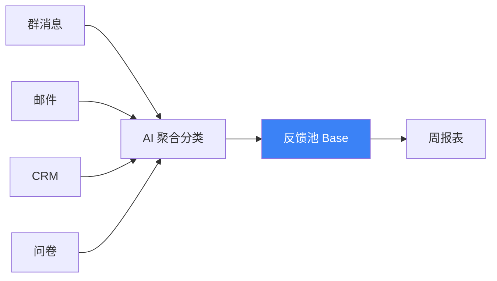

### 工作流 5：项目台账（Base 项目管理）

建一张 Base，含项目表 / 任务表 / 风险表 / 反馈表 / 交付物表。CLI 维护数据，飞书界面读数据，AI 做周报。

### 工作流 6：跨群消息聚合（一人公司神器）

**场景**：你同时跟 8 个客户群、3 个产品群、2 个内部群。每天信息洪流，但真正要处理的不到 10 条。

**做法**：

```bash
# 1. 列出所有要监听的群 ID（一次性）
GROUPS=(oc_a oc_b oc_c oc_d ...)

# 2. 每天用脚本聚合
for g in ${GROUPS[@]}; do
  lark-cli im +chat-messages-list \
    --chat-id "$g" \
    --start "$(date -v-1d -u +%Y-%m-%dT00:00:00Z)" \
    --format json
done > today.json

# 3. 让 AI 总结
```

输出一张"今天 8 个群里我必须看的 6 件事"，飞书一键回复。

### 工作流 7：从飞书文档生成日历事件

**场景**：你有一篇"Q3 项目排期"文档，里面写满了"5/30 评审"、"6/3 验收"等节点。

```bash
# 1. 拉文档
lark-cli markdown fetch --doc-token doccnXXX -o ./plan.md

# 2. AI 提取所有日期 + 标题
# 3. 批量创建日历事件
lark-cli calendar +create --title "..." --start "..." --end "..." ...
```

> ⚠️ 创建日程是**不可逆动作**。务必加 `--dry-run` 让用户确认每一条。

### 工作流 8：实时事件触发（高级）

`lark-cli event` 支持订阅实时事件。比如：

> 当"客户支持群"里有人发"加急"两个字，自动 @ 我并创建一条飞书任务。

```bash
lark-cli event +subscribe \
  --event-type "im.message.receive_v1" \
  --filter '{"chat_id":"oc_xxx","contains":"加急"}' \
  --on-event 'lark-cli task tasks create --data ...'
```

### 工作流 9：周报自动化（综合）

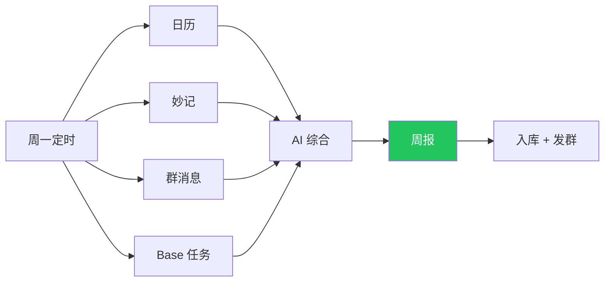

### 工作流 10：把 secondbrain（个人 Wiki）发布到飞书

这是 Mike 本人用得最多的一个。本地 Obsidian / VitePress 内的方法论、模板、复盘 → 用 CLI 一键发布飞书文档供同事浏览。

```bash
# 用 markdown create 即可
lark-cli markdown create \
  --file ~/Desktop/secondbrain/wiki/playbooks/某方法.md \
  --title "某方法 - $(date +%Y-%m-%d)"
```

---

## 十一、进阶技巧

### 11.1 输出格式

```bash
--format json     # 默认，完整 JSON
--format ndjson   # 每行一个 JSON，适合管道
--format table    # 终端可读表格
--format csv      # 适合导入 Excel
--format pretty   # 人类友好彩色高亮
```

例：

```bash
lark-cli calendar +agenda --format table
lark-cli base records list --params '...' --format csv > today.csv
```

### 11.2 分页

```bash
--page-all                 # 自动翻页
--page-size 50             # 每页大小
--page-limit 10            # 最多翻 10 页
--page-delay 500           # 每页间隔 500ms（避免限流）
```

### 11.3 jq 内置过滤

```bash
# 内置 jq
lark-cli im +chat-messages-list --chat-id oc_xxx \
  -q '.data.messages[] | {sender:.sender.name, content:.content}'
```

无需 `| jq` 管道。

### 11.4 Dry-Run

任何写操作前加 `--dry-run`：

```bash
lark-cli im +messages-send --chat-id oc_xxx --text "测试" --dry-run
```

打印请求内容但不真发。

### 11.5 Schema 自省

不知道某个 API 要传什么？让 CLI 告诉你：

```bash
# 列出所有服务
lark-cli schema

# 看某个 API 的参数、返回、权限
lark-cli schema calendar.events.instance_view --format pretty
lark-cli schema im.messages.delete
```

这个能力对 AI Agent 尤其重要——它能"自己学会"任何新 API。

### 11.6 通用 API（兜底）

```bash
lark-cli api GET /open-apis/calendar/v4/calendars \
  --params '{"page_size":50}'

lark-cli api POST /open-apis/im/v1/messages \
  --params '{"receive_id_type":"chat_id"}' \
  --data '{"receive_id":"oc_xxx","msg_type":"text","content":"{\"text\":\"hi\"}"}'
```

2500+ 飞书开放 API 全覆盖。

### 11.7 配置 Profile 与多账号

```bash
lark-cli profile create --name work
lark-cli profile create --name personal
lark-cli profile use work
lark-cli profile list

# 或单次切换
lark-cli --profile personal calendar +agenda
```

### 11.8 与 shell 管道结合

```bash
# 把今天所有日程标题导出到 Markdown 列表
lark-cli calendar +agenda --format json \
  | jq -r '.events[] | "- \(.start_time) \(.title)"' \
  > today.md

# 把项目群本周消息转给 ChatGPT 做摘要
lark-cli im +chat-messages-list --chat-id oc_xxx \
  --start "$(date -v-7d -u +%Y-%m-%dT00:00:00Z)" \
  --format json \
  | jq '.data.messages[] | {t:.create_time, s:.sender.name, c:.content}' \
  | gpt summarize
```

---

## 十二、安全边界与最小权限策略

飞书 CLI 是"以你的身份"操作飞书。这意味着它能做的事 = 你能做的事。**所以安全策略不能偷懒**。

<div class="diagram-row">

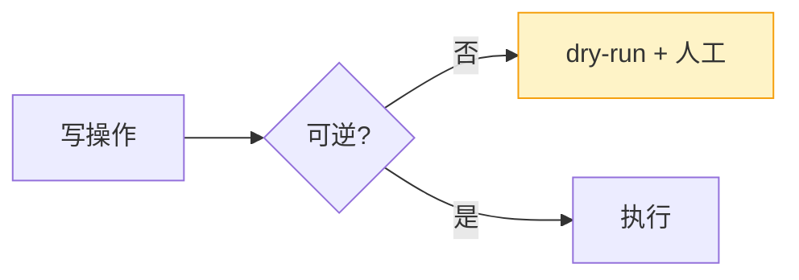

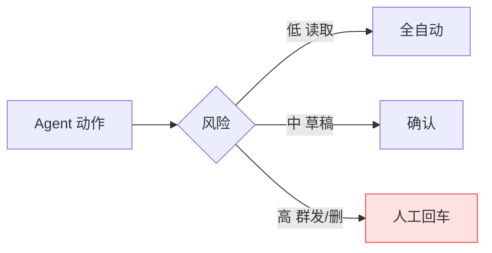

</div>

### 12.1 权限授予的金科玉律

| ✅ 做 | ❌ 不做 |
|---|---|
| 用 `--domain calendar,im` 按需授权 | 一上来就 `--recommend` 全开 |
| 定期 `auth status` 看授了哪些 | 一年都不回头看 |
| 写入只针对"已知文件夹 / 已知 Base" | 写入飞书全局空间 |
| 重要操作必 `--dry-run` | 直接执行 |
| Agent 自动化只做低风险动作 | 让 Agent 自动改权限 / 群发 |

### 12.2 凭证存储

CLI 会把 App Secret 和 OAuth Token 加密存到：
- **macOS**：Keychain
- **Linux**：Secret Service（gnome-keyring / kwallet）
- **Windows**：Credential Manager

**不在任何文件里明文存。** 但请仍然注意：
- 不要把 `~/.config/lark-cli/` 目录提交到 Git
- 不要在公开聊天里粘贴 `lark-cli config show` 的输出

### 12.3 给 AI Agent 划红线

在你的项目 `CLAUDE.md` 或 `AGENTS.md` 里加一段：

```markdown
## 飞书 CLI 红线

- 任何 `--as bot` 操作不得自动执行，必须人工确认
- 任何 `im +messages-send` 给"不是私聊 / 不是已知群"的发消息，必须先 `--dry-run`
- 任何 `drive permissions` 改动，必须用户确认
- 任何 `wiki nodes delete`、`docs delete`、`base tables delete` 一律拒绝
- 任何超过 10 条的批量写入，必须先报告"我准备做什么"
```

### 12.4 数据流向：什么进 secondbrain，什么不进

| 适合进个人 Wiki | 不适合 |
|---|---|
| 方法论、模板、复盘 | 飞书 token、App Secret |
| 去敏后的项目经验 | 客户敏感原文 |
| 自己的笔记 | 员工隐私 |
| 公开资料 | 未脱敏群聊全文 |

---

## 十三、故障排查（FAQ）

### Q1：`lark-cli auth login` 后浏览器没打开？

复制终端打印的 URL 手动粘贴。或检查默认浏览器设置。

### Q2：报 `403 forbidden` / 权限不足？

```bash
lark-cli auth check
lark-cli auth scopes
lark-cli auth login --domain <你需要的域>
```

按提示重新授权。

### Q3：`lark-cli doctor` 显示网络问题？

检查你是否能访问 `open.feishu.cn`。企业内网可能有代理：

```bash
export HTTPS_PROXY=http://your-proxy:8080
```

### Q4：消息发不出去，提示 `chat_id invalid`？

`chat_id` 是 `oc_` 开头的字符串，不是群名。先用 `lark-cli im +chat-search --query "群名"` 拿到正确 ID。

### Q5：怎么完全重置？

```bash
lark-cli auth logout
rm -rf ~/.config/lark-cli/
# 系统钥匙串里搜 "lark-cli" 删除
```

### Q6：Skills 在 Claude Code 里没被自动调用？

检查：
1. `~/.agents/skills/` 下有 `lark-*` 目录吗
2. 在 Claude Code 里 `/help` 或 `/skills` 能看到 `lark-` 开头的 skills 吗
3. 你的提问里有"飞书 / Lark / 群 / 文档 / 日历"等触发词吗

### Q7：能在没图形界面的服务器上用吗？

可以。OAuth 登录改成 device code 模式：

```bash
lark-cli auth login --device-code
# 终端会打印一个 URL 和一个 code
# 在任意有图形界面的设备打开 URL 输入 code
# 服务器端轮询拿到 token
```

或者直接 `--no-wait` 立即返回，之后再 `auth resume`。

### Q8：API 调用速率限制怎么办？

```bash
--page-delay 500
```

或在脚本里加 `sleep`。飞书开放平台单 App 默认 100 QPS，对个人使用完全够。

### Q9：CLI 怎么更新？

```bash
lark-cli update
# 或
npm install -g @larksuite/cli@latest
```

### Q10：能贡献代码或反馈 bug 吗？

可以。仓库在 [github.com/larksuite/cli](https://github.com/larksuite/cli)，issues 和 PR 都接受。

---

## 十四、延伸阅读与社区资源

### 官方资源
- **GitHub 仓库**：[larksuite/cli](https://github.com/larksuite/cli)
- **中文 README**：[README.zh.md](https://github.com/larksuite/cli/blob/main/README.zh.md)
- **官方文档站**：[feishu-cli.com](https://feishu-cli.com/zh/)
- **飞书开放平台**：[open.feishu.cn](https://open.feishu.cn/document/)
- **应用管理后台**：[open.feishu.cn/app](https://open.feishu.cn/app)
- **Anthropic Skills 协议**：[github.com/anthropics/skills](https://github.com/anthropics/skills)

### 优秀社区文章
- 思否：[飞书开源 CLI 工具 lark-cli：200+ 命令与 19 个 AI Agent Skills 全解析](https://segmentfault.com/a/1190000047688941)
- 何远（heyuan110）：[Lark CLI 完全指南：用命令行和 AI Agent 操控飞书](https://www.heyuan110.com/zh/posts/ai/2026-03-29-lark-cli-guide/)
- 火山引擎开发者社区：[飞书 CLI 与多维表格集成实战](https://developer.volcengine.com/articles/7628798153734979634)
- CSDN：[一天一个开源项目（第 62 篇）：lark-cli](https://gitcode.csdn.net/69ce62090a2f6a37c59c90cd.html)
- 知乎：[飞书 CLI 开源解读：让 AI Agent 接管你的办公协作](https://zhuanlan.zhihu.com/p/2021337273094947061)
- 飞书官方文章：[CLI 是什么？飞书 CLI 又是什么？](https://www.feishu.cn/content/article/7624059344114699194)
- 飞书官方文章：[飞书 CLI 安装与使用指南：让 AI Agent 真正接入飞书](https://www.feishu.cn/content/article/7623291503305083853)
- 深度评测：[Lark CLI 测评：让 AI 直接操作飞书的秘密武器](https://www.opp2.com/380345.html)
- 深度解读：[飞书 CLI（lark-cli）深度解析：安装部署教程与 AI Agent 实战指南](https://www.fuyuan7.com/post-1834.html)
- 青岩码农兜底日记：[飞书官方 CLI 完整指南：从安装到 AI Agent 自动化办公](https://blog.deepai.wiki/posts/lark-cli-guide)

### 配套 AI Agent 与工具
- [Claude Code](https://claude.com/claude-code) — Anthropic 官方 Coding Agent
- [Codex CLI](https://github.com/openai/codex) — OpenAI Coding Agent
- [Cursor](https://cursor.com) — AI 优先 IDE
- [Windsurf](https://codeium.com/windsurf) — AI 优先 IDE
- [Hermes](https://hermes.box) — 多模型 Agent 平台

### 本站相关阅读
- [Harness Engineering 完全教程](/harness/module-0)
- [Harness 教程附录：参考项目·文章·工具·金句](/harness/appendix)

---

## 结语：让 AI 替你"在飞书里点来点去"

如果你只记得这篇文章的一句话，请记这句：

> **飞书 CLI 不是给程序员的玩具，是给所有"在飞书里工作"的人的解放工具。**
>
> 它把"打开飞书、点 5 下、复制 3 段文字"这种重复劳动，变成"对 AI 说一句话"。

如果你只动手做一件事，请做这件：

```bash
npm install -g @larksuite/cli
npx skills add larksuite/cli -y -g
lark-cli config init --new
lark-cli auth login --recommend
```

四条命令，五分钟。然后打开 Claude Code，对它说：

> "看看我今天有什么会议。"

剩下的，交给 2026 年。

---

*作者：Mike · 最近更新：2026-05-30 · 站点：[wiki.karaithy.com](https://wiki.karaithy.com)*

*本文献给所有还在飞书里"手动复制粘贴" 50 次的同事们。*
